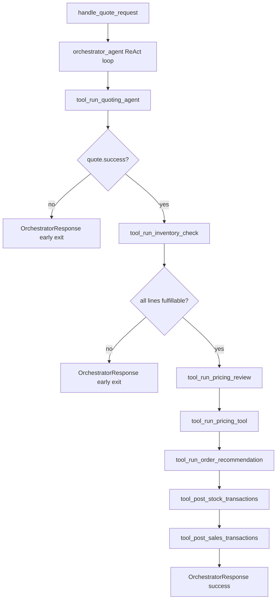
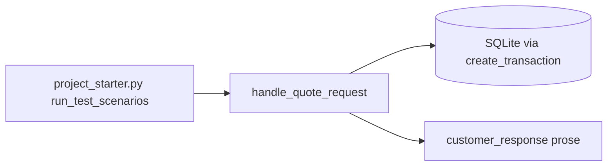

# Orchestrator Agent — Specification & Test Plan

**Version:** 1.3  
**Date:** 2026-06-09  
**Phase:** 3 — Implemented (agentic)  
**System Overview:** [../system_overview.md](../system_overview.md)  
**Upstream:** All Phase 1–2E components (see [§2](#2-architecture))

---

## Table of Contents

1. [Purpose](#1-purpose)
2. [Architecture](#2-architecture)
3. [ReAct Loop](#3-react-loop)
4. [File Layout](#4-file-layout)
5. [Input / Output Schema](#5-input--output-schema)
6. [Pipeline Steps](#6-pipeline-steps)
7. [Primary Directive](#7-primary-directive)
8. [Failure Messages](#8-failure-messages)
9. [Tools](#9-tools)
10. [Transaction Posting](#10-transaction-posting)
11. [project_starter.py Integration](#11-project_starterpy-integration)
12. [Agent Definition](#12-agent-definition)
13. [Test Plan](#13-test-plan)
14. [Downstream Contract](#14-downstream-contract)

---

## 1. Purpose

Receive a customer quote request (natural language plus `(Date of request: YYYY-MM-DD)` suffix) and run the **full quote-to-ledger pipeline** defined in [system_overview.md](../system_overview.md):

1. Parse the request into a structured quote.
2. Check inventory and supplier lead times.
3. Review historical pricing bands.
4. Validate cash and build strategy recommendations.
5. Recommend final customer pricing and compose response prose.
6. **Post supplier stock orders** to the ledger on `date_of_request`.
7. **Post customer sales** to the ledger on `need_date`.

The orchestrator is a **ReAct agent** (Reason → Act → Observe) built with pydantic-ai. At each step the LLM records an explicit **Thought** (why this step is needed and whether gates pass), calls one **Action** (tool), and reads the **Observation** (typed tool result) before proceeding.

Unlike sub-agents that own fuzzy parsing or pricing judgment, the orchestrator owns **sequencing, gating, and ledger posting**. Step order is fixed; the agent must not skip, reorder, or invent steps.

**Agentic requirement:** The solution **must** be agentic — the orchestrator drives the seven-step pipeline via an LLM ReAct loop and registered pydantic-ai tools. A plain-Python `for`-loop pipeline (`run_pipeline` / `_step_*` functions) that calls sub-agents directly **does not satisfy** this specification, even if it produces the same outputs.

**Replaces Phase 2F Place Order Tool for v1:** Stock procurement is posted by calling `create_transaction` directly from `recommendation.stock_orders` (see [§9](#9-transaction-posting)). A future Place Order Tool may wrap the same calls.

Callers use `handle_quote_request()` and receive an `OrchestratorResponse` suitable for `project_starter.py` `run_test_scenarios()` (print, CSV export, financial state updates).

---

## 2. Architecture

### End-to-end flow



| Step | Component | Owner | Output |
|---|---|---|---|
| 1 | [Quoting Agent](quoting_agent.md) | `tool_run_quoting_agent` | `QuoteResponse` |
| 2 | [Inventory Tool](../tools/inventory_tool.md) | `tool_run_inventory_check` | `InventoryResult` |
| 3 | [Pricing Review Agent](pricing_review_agent.md) | `tool_run_pricing_review` | `PricingReviewResponse` |
| 4 | [Pricing Tool](../tools/pricing_tool.md) | `tool_run_pricing_tool` | `PricingResponse` |
| 5 | [Order Recommendation Agent](order_recommendation_agent.md) | `tool_run_order_recommendation` | `OrderRecommendationResponse` |
| 6 | `create_transaction` (stock) | `tool_post_stock_transactions` | `PostTransactionsResult` |
| 7 | `create_transaction` (sales) | `tool_post_sales_transactions` | `PostTransactionsResult` |

### Orchestrator placement



`project_starter.py` imports **one** entry point and never calls sub-agents or `create_transaction` directly.

---

## 3. ReAct Loop

Each pipeline step is one ReAct cycle. The agent documents reasoning in prose **before** every tool call.

| Phase | Orchestrator responsibility |
|---|---|
| **Thought** | State the current step number, why it runs next, and which gate predicates must hold. If a prior step failed, explain early exit and do not call downstream tools. |
| **Action** | Invoke exactly one step tool (see [§9](#9-tools)). |
| **Observation** | Read the tool return value (`success`, key fields, errors). Decide whether to proceed to the next step or assemble `OrchestratorResponse` with `success=false`. |

**Fixed step order (mandatory):**

```
1 → 2 → 3 → 4 → 5 → 6 → 7
```

The LLM must not call step 4 before step 3 completes, must not post sales before stock orders, and must not call `create_transaction` itself — only the posting tools.

**Early exit:** When any gate fails or a component returns `success=false`, the agent stops the loop and returns `OrchestratorResponse` with:
- `success=false`
- `step_completed` = last successful step name
- `customer_response` = human-readable explanation (see [§8](#8-failure-messages))
- `debug` with `tools_called`, `last_tool`, `last_tool_error`, `failure_kind`, `expected_next_step`

**Exceptions:** Uncaught errors in `handle_quote_request()` set `failure_kind="react_exception"` and `debug.agent_exception`.

---

## 4. File Layout

```
/workspace/
├── agents/
│   └── orchestrator_agent.py       # ReAct agent, tools, models, entry point
├── diagrams/
│   └── orchestrator_agent.md       # Pipeline overview diagram
├── pipeline/
│   └── full_pipeline.py            # Shared validators (used by verbose pipeline tests)
├── tests/
│   └── test_orchestrator_agent.py  # Runnable scenarios (OC-H*, OC-T*, OC-F*, …)
├── project_starter.py              # create_transaction, run_test_scenarios integration
└── specification/
    └── agents/
        └── orchestrator_agent.md   # This document
```

### Module-level constants

```python
MODEL = "openai:gpt-5.4-mini"

STEP_QUOTING = "quoting"
STEP_INVENTORY = "inventory"
STEP_PRICING_REVIEW = "pricing_review"
STEP_PRICING = "pricing"
STEP_ORDER_RECOMMENDATION = "order_recommendation"
STEP_POST_STOCK = "post_stock"
STEP_POST_SALES = "post_sales"

DELIVERY_TIMEFRAME_CUSTOMER_RESPONSE = (
    "Thank you for your order. Unfortunately, we cannot deliver this order "
    "within your requested timeframe. ..."
)

ORDER_TOO_LARGE_CUSTOMER_RESPONSE = (
    "We truly appreciate your order. However, this order is too large for "
    "the size of our business at this time. ..."
)

PIPELINE_STEPS = (
    STEP_QUOTING,
    STEP_INVENTORY,
    STEP_PRICING_REVIEW,
    STEP_PRICING,
    STEP_ORDER_RECOMMENDATION,
    STEP_POST_STOCK,
    STEP_POST_SALES,
)
```

---

## 5. Input / Output Schema

### Request

```python
class OrchestratorRequest(BaseModel):
    request_with_date: str
    customer: Optional[CustomerContext] = None
```

When `customer` is omitted, the order recommendation step uses:

```python
CustomerContext(original_request_text=request_with_date)
```

When called from `run_test_scenarios()`, populate via `customer_context_from_csv_row(row)` from `agents.order_recommendation_agent`.

### Response (project_starter contract)

```python
class PostedTransaction(BaseModel):
    transaction_id: int
    item_name: str
    transaction_type: str          # "stock_orders" | "sales"
    quantity: int
    price: float
    transaction_date: str          # YYYY-MM-DD

class OrchestratorDebugInfo(BaseModel):
    """Diagnostics when the ReAct agent fails or exits early."""
    tools_called: list[str] = Field(default_factory=list)
    last_tool: Optional[str] = None
    last_tool_error: Optional[str] = None
    agent_exception: Optional[str] = None
    failure_kind: Optional[Literal[
        "react_exception",
        "react_incomplete",
        "business_failure",
    ]] = None
    expected_next_step: Optional[str] = None

class OrchestratorResponse(BaseModel):
    success: bool
    step_completed: str              # last step that finished successfully
    customer_response: str           # prose for customer OR error explanation
    total_quote_amount: Optional[float] = None
    date_of_request: Optional[str] = None
    need_date: Optional[str] = None
    stock_transactions_posted: int = 0
    sales_transactions_posted: int = 0
    posted_transactions: list[PostedTransaction] = Field(default_factory=list)
    error: Optional[str] = None
    debug: Optional[OrchestratorDebugInfo] = None

    def __str__(self) -> str:
        """Used by project_starter run_test_scenarios print and results CSV."""
        return self.customer_response
```

| Field | `project_starter.py` usage |
|---|---|
| `customer_response` | `print(f"Response: {response}")` — `str(response)` delegates here |
| `success` | Optional branching / logging |
| `total_quote_amount` | Optional audit |
| `posted_transactions` | Verify ledger writes in tests |
| `step_completed` | Diagnose partial pipeline failures |
| `debug` | Tool call trace and failure classification in tests |

**Success path:** `success=true`, `step_completed="post_sales"`, `customer_response` = order recommendation prose (with excluded-product notice appended when needed), `total_quote_amount` set, `sales_transactions_posted >= 1`. `stock_transactions_posted` may be 0 when all stock is on hand.

**Failure path:** `success=false`, `customer_response` explains failure in plain language (see [§8](#8-failure-messages)), `error` duplicates or extends machine-readable reason, `debug.failure_kind="business_failure"` (or `"react_exception"` on uncaught error).

---

## 6. Pipeline Steps

### Step 1 — Quoting Agent

```python
from agents.quoting_agent import call_quoting_agent

quote = call_quoting_agent(request.request_with_date)
```

**Gate to continue:** `quote.success` and non-null `date_of_request`, `need_date`, non-empty `items`.

**Early exit:** Return `OrchestratorResponse` with `step_completed="quoting"` (or empty if quote never succeeded), `customer_response=quote.error or "Quote could not be parsed."`.

### Step 2 — Inventory Tool

```python
from tools.inventory_tool import InventoryTool, quote_to_inventory_request

inventory = InventoryTool().check(quote_to_inventory_request(quote))
```

**Gate:** `can_check_inventory(quote)` before calling (see [system_overview.md](../system_overview.md)).

**Gate to continue:** `all(item.success for item in inventory.items)`.

**Early exit:** `step_completed` = last successful step (typically `"quoting"`). `customer_response` = `DELIVERY_TIMEFRAME_CUSTOMER_RESPONSE` when any line fails stock/lead-time check.

### Step 3 — Pricing Review Agent

```python
from agents.pricing_review_agent import call_pricing_review_agent, PricingReviewRequest

pricing_review = call_pricing_review_agent(PricingReviewRequest(quote=quote))
```

**Gate:** `can_review_pricing(quote)`.

**Gate to continue:** `pricing_review.success`.

### Step 4 — Pricing Tool

```python
from tools.pricing_tool import ItemUnitPrices, PricingTool, PricingRequest

unit_prices = [
    ItemUnitPrices(
        product_name=item.product_name,
        min_unit_price=item.min_unit_price,
        avg_unit_price=item.avg_unit_price,
        max_unit_price=item.max_unit_price,
    )
    for item in pricing_review.items
]
pricing = PricingTool().price(
    PricingRequest(quote=quote, inventory=inventory, unit_prices=unit_prices)
)
```

**Gate:** `can_price(quote, inventory)`.

**Gate to continue:** `pricing.success`.

### Step 5 — Order Recommendation Agent

```python
from agents.order_recommendation_agent import (
    call_order_recommendation_agent,
    OrderRecommendationRequest,
    CustomerContext,
)

recommendation = call_order_recommendation_agent(
    OrderRecommendationRequest(
        quote=quote,
        inventory=inventory,
        pricing=pricing,
        customer=customer or CustomerContext(
            original_request_text=request.request_with_date
        ),
    )
)
```

**Gate:** `can_recommend_order(quote, inventory, pricing)`.

**Gate to continue:** `recommendation.success`, non-empty `customer_response`, non-empty `sales` batch.

**Early exit (cash blocked):** When `_order_blocked_by_cash(deps)` is true (mid strategy has no included lines and pricing reports insufficient cash), `customer_response` = `ORDER_TOO_LARGE_CUSTOMER_RESPONSE`; `step_completed` remains at `"pricing"`.

### Step 6 — Post stock orders (`create_transaction`)

Post every record in `recommendation.stock_orders` (if present).

| Rule | Value |
|---|---|
| `transaction_type` | `"stock_orders"` |
| `date` | `record.transaction_date` — must equal `quote.date_of_request` |
| Order | Post **before** sales (step 7) |

If `stock_orders` is `None` (all stock on hand), skip posting; `stock_transactions_posted=0`.

### Step 7 — Post sales (`create_transaction`)

Post every record in `recommendation.sales.transactions`.

| Rule | Value |
|---|---|
| `transaction_type` | `"sales"` |
| `date` | `record.transaction_date` — must equal `quote.need_date` |

After posting, set `customer_response` from `recommendation.customer_response` (append excluded-product notice when needed) and `total_quote_amount` from `recommendation.total_quote_amount`.

---

## 7. Primary Directive

`ORCHESTRATOR_DIRECTIVE` in `agents/orchestrator_agent.py`:

```
You are the Munder Difflin Orchestrator Agent.
You run a fixed seven-step quote-to-order pipeline using ReAct (Thought, Action, Observation).

For EACH step, before calling a tool:
  THOUGHT: State the step name, why it is next, and which gates must pass.

Then call exactly ONE tool (Action).
Read the tool result (Observation).
If the gate for the NEXT step fails, stop and return OrchestratorResponse with success=false.

Steps (in order — never skip or reorder):

1. tool_run_quoting_agent
   - Input: request_with_date from OrchestratorRequest
   - Stop if quote.success is false

2. tool_run_inventory_check
   - Requires successful quote from step 1
   - Stop if any inventory line has success=false

3. tool_run_pricing_review
   - Requires fulfillable inventory from step 2
   - Stop if pricing_review.success is false

4. tool_run_pricing_tool
   - Requires pricing review from step 3
   - Stop if pricing.success is false

5. tool_run_order_recommendation
   - Requires pricing from step 4 and customer context from request
   - Stop if recommendation.success is false

6. tool_post_stock_transactions
   - Post stock_orders on date_of_request via create_transaction
   - Skip gracefully when stock_orders is null

7. tool_post_sales_transactions
   - Post sales on need_date via create_transaction
   - Then return OrchestratorResponse with success=true

Final output rules:
- customer_response = recommendation.customer_response on success
- total_quote_amount = recommendation.total_quote_amount on success
- On failure, customer_response = clear explanation for the customer (no raw JSON)
- Never call create_transaction except through posting tools
```

---

## 8. Failure Messages

`_build_failure_message(deps)` maps pipeline state to customer-facing prose. Priority order:

| Condition | Helper | `customer_response` |
|---|---|---|
| Any inventory line `success=false` | `_inventory_timeline_failure` | `DELIVERY_TIMEFRAME_CUSTOMER_RESPONSE` |
| Cash cannot fund mid-strategy order | `_order_blocked_by_cash` | `ORDER_TOO_LARGE_CUSTOMER_RESPONSE` |
| Quote parse failure | — | `quote.error` or `"Quote could not be parsed."` |
| Pricing review failure | — | `pricing_review.error` or `"Pricing review failed."` |
| Pricing tool failure | — | `"Pricing could not be completed for this order."` |
| Order recommendation failure | — | `recommendation.error` or `"Order recommendation failed."` |
| Other tool error | — | `deps.last_tool_error` |
| Fallback | — | `"The orchestrator could not complete this request."` |

`_order_blocked_by_cash` is true when `pricing.success`, the `average_pricing` strategy has no included lines, and any strategy recommendation error contains `"Insufficient cash"`.

On success, `_append_excluded_products_notice()` appends a short notice when `quote.excluded_products` is non-empty and the recommendation prose does not already mention those product names.

---

## 9. Tools

All tools are pydantic-ai functions registered on `orchestrator_agent`. They read/write shared `OrchestratorDeps` holding `quote`, `inventory`, `pricing_review`, `pricing`, `recommendation`, and `posted_transactions`.

| Tool | Action | Returns |
|---|---|---|
| `tool_run_quoting_agent` | `call_quoting_agent(request_with_date)` | `QuoteResponse` |
| `tool_run_inventory_check` | `InventoryTool().check(...)` | `InventoryResult` |
| `tool_run_pricing_review` | `call_pricing_review_agent(...)` | `PricingReviewResponse` |
| `tool_run_pricing_tool` | `PricingTool().price(...)` | `PricingResponse` |
| `tool_run_order_recommendation` | `call_order_recommendation_agent(...)` | `OrderRecommendationResponse` |
| `tool_post_stock_transactions` | Loop `create_transaction` for `stock_orders` | `PostTransactionsResult` |
| `tool_post_sales_transactions` | Loop `create_transaction` for `sales` | `PostTransactionsResult` |

Each tool records its name in `deps.tools_called` via `_record_tool_start()` for observability and tests.

### `OrchestratorDeps`

```python
@dataclass
class OrchestratorDeps:
    request: OrchestratorRequest
    create_transaction_fn: CreateTransactionFn = create_transaction
    quote: QuoteResponse | None = None
    inventory: InventoryResult | None = None
    pricing_review: PricingReviewResponse | None = None
    pricing: PricingResponse | None = None
    recommendation: OrderRecommendationResponse | None = None
    posted_transactions: list[PostedTransaction] = field(default_factory=list)
    step_completed: str = ""
    stock_transactions_posted: int = 0
    sales_transactions_posted: int = 0
    tools_called: list[str] = field(default_factory=list)
    last_tool: str = ""
    last_tool_error: Optional[str] = None
```

`create_transaction_fn` is injectable on `OrchestratorDeps` for tests (no real DB writes in unit tests).

### 9.1 `tool_post_stock_transactions` (deterministic)

```python
class PostTransactionsResult(BaseModel):
    posted_count: int
    transactions: list[PostedTransaction]
    error: Optional[str] = None

def post_stock_transactions(
    recommendation: OrderRecommendationResponse,
    *,
    create_transaction_fn=create_transaction,
) -> PostTransactionsResult:
    """Post supplier stock orders on date_of_request."""
    if recommendation.stock_orders is None:
        return PostTransactionsResult(posted_count=0, transactions=[])

    posted: list[PostedTransaction] = []
    for record in recommendation.stock_orders.transactions:
        if record.transaction_type != "stock_orders":
            return PostTransactionsResult(
                posted_count=0,
                transactions=[],
                error=f"Expected stock_orders, got {record.transaction_type!r}",
            )
        if record.transaction_date != recommendation.date_of_request:
            return PostTransactionsResult(
                posted_count=0,
                transactions=[],
                error="stock_orders.transaction_date must equal date_of_request",
            )
        tx_id = create_transaction_fn(
            item_name=record.item_name,
            transaction_type="stock_orders",
            quantity=record.quantity,
            price=record.price,
            date=record.transaction_date,
        )
        posted.append(
            PostedTransaction(
                transaction_id=tx_id,
                item_name=record.item_name,
                transaction_type="stock_orders",
                quantity=record.quantity,
                price=record.price,
                transaction_date=record.transaction_date,
            )
        )
    return PostTransactionsResult(posted_count=len(posted), transactions=posted)
```

### 9.2 `tool_post_sales_transactions` (deterministic)

```python
def post_sales_transactions(
    recommendation: OrderRecommendationResponse,
    *,
    create_transaction_fn=create_transaction,
) -> PostTransactionsResult:
    """Post customer sales on need_date."""
    if recommendation.sales is None or not recommendation.sales.transactions:
        return PostTransactionsResult(
            posted_count=0,
            transactions=[],
            error="success path requires non-empty sales batch",
        )

    posted: list[PostedTransaction] = []
    for record in recommendation.sales.transactions:
        if record.transaction_type != "sales":
            return PostTransactionsResult(
                posted_count=0,
                transactions=[],
                error=f"Expected sales, got {record.transaction_type!r}",
            )
        if record.transaction_date != recommendation.need_date:
            return PostTransactionsResult(
                posted_count=0,
                transactions=[],
                error="sales.transaction_date must equal need_date",
            )
        tx_id = create_transaction_fn(
            item_name=record.item_name,
            transaction_type="sales",
            quantity=record.quantity,
            price=record.price,
            date=record.transaction_date,
        )
        posted.append(
            PostedTransaction(
                transaction_id=tx_id,
                item_name=record.item_name,
                transaction_type="sales",
                quantity=record.quantity,
                price=record.price,
                transaction_date=record.transaction_date,
            )
        )
    return PostTransactionsResult(posted_count=len(posted), transactions=posted)
```

`create_transaction_fn` is injectable for tests (no real DB writes in unit tests).

---

## 10. Transaction Posting

### Execution order (mandatory)

1. **Stock orders** — `date = date_of_request` (request date; funds supplier replenishment when order is placed).
2. **Sales** — `date = need_date` (delivery / revenue recognition date).

This matches [order_recommendation_agent.md §10.3](order_recommendation_agent.md#103-orchestrator-execution-order).

### Field mapping

| `TransactionRecord` field | `create_transaction` arg |
|---|---|
| `item_name` | `item_name` |
| `transaction_type` | `transaction_type` (`"stock_orders"` or `"sales"`) |
| `quantity` | `quantity` |
| `price` | `price` (total line price, not per-unit) |
| `transaction_date` | `date` |

### Invariants (enforced in posting tools)

- Stock posts use `transaction_date == quote.date_of_request`.
- Sales posts use `transaction_date == quote.need_date`.
- Sum of sales `price` equals `recommendation.total_quote_amount` (± $0.01) — already validated by order recommendation agent.

---

## 11. project_starter.py Integration

### Import block

```python
from agents.orchestrator_agent import (
    OrchestratorRequest,
    handle_quote_request,
)
from agents.order_recommendation_agent import customer_context_from_csv_row
```

### `run_test_scenarios()` call site

```python
response = handle_quote_request(
    OrchestratorRequest(
        request_with_date=request_with_date,
        customer=customer_context_from_csv_row(row),
    )
)

print(f"Response: {response}")
```

`str(response)` returns `customer_response` for backward-compatible printing and CSV export:

```python
results.append(
    {
        "request_id": idx + 1,
        "request_date": request_date,
        "cash_balance": current_cash,
        "inventory_value": current_inventory,
        "response": response,
    }
)
```

### Alias

`run_request = handle_quote_request` — optional shorthand documented in system overview.

---

## 12. Agent Definition

```python
from pydantic_ai import Agent

orchestrator_agent = Agent(
    MODEL,
    system_prompt=ORCHESTRATOR_DIRECTIVE,
    output_type=OrchestratorResponse,
    tools=[
        tool_run_quoting_agent,
        tool_run_inventory_check,
        tool_run_pricing_review,
        tool_run_pricing_tool,
        tool_run_order_recommendation,
        tool_post_stock_transactions,
        tool_post_sales_transactions,
    ],
    deps_type=OrchestratorDeps,
)


def handle_quote_request(request: OrchestratorRequest) -> OrchestratorResponse:
    """Run the seven-step ReAct pipeline and return a project_starter-ready response."""
    deps = OrchestratorDeps(request=request)
    try:
        result = orchestrator_agent.run_sync(
            request.model_dump_json(), deps=deps
        ).output
        return _finalize_orchestrator_response(result, deps)
    except Exception as exc:
        return _finalize_orchestrator_response(
            _failure_response_from_deps(deps),
            deps,
            agent_exception=str(exc),
            failure_kind="react_exception",
        )


run_request = handle_quote_request  # alias
```

**Public exports:** `OrchestratorRequest`, `OrchestratorResponse`, `PostedTransaction`, `handle_quote_request`, `run_request` (alias)

**Internal (testable):** `post_stock_transactions`, `post_sales_transactions`, `can_check_inventory`, gate helpers, `OrchestratorDeps`, individual `tool_*` functions

**Not acceptable:** A deterministic `run_pipeline()` / `_PIPELINE_STEPS` loop that bypasses `orchestrator_agent.run_sync()`. Posting tools (steps 6–7) may remain deterministic Python inside their tool wrappers; steps 1–7 must be invoked by the ReAct agent.

---

## 13. Test Plan

Scenarios in `tests/test_orchestrator_agent.py`.

```bash
source /workspace/.venv/bin/activate
PYTHONPATH=/workspace python tests/test_orchestrator_agent.py
```

**17/17** scenarios in `tests/test_orchestrator_agent.py`. Mock `create_transaction` in posting tests. OC-H* require `OPENAI_API_KEY`.

`handle_quote_request` runs only the ReAct agent (no deterministic pipeline fallback). On failure or early exit, `OrchestratorResponse.debug` records `tools_called`, `last_tool`, `last_tool_error`, `failure_kind`, and `expected_next_step`.

### 13.1 Happy path (LLM — requires `OPENAI_API_KEY`)

| ID | Scenario | Key assertions |
|---|---|---|
| OC-H1 | Full pipeline — party request (CSV index 4) | `success=true`; `step_completed=post_sales`; sales posted on `need_date` |
| OC-H2 | Full pipeline — assembly request (CSV index 5) | Stock + sales posted; `str(response)` non-empty |
| OC-H3 | All stock in hand (CSV index 11) | `stock_transactions_posted=0`; `sales_transactions_posted>=1` |
| OC-V1 | Default pipeline indices load | `DEFAULT_PIPELINE_INDICES` resolves from CSV |

### 13.2 Transaction posting (deterministic — no LLM)

| ID | Scenario | Key assertions |
|---|---|---|
| OC-T1 | `post_stock_transactions` — mixed order | All `transaction_date == date_of_request`; `transaction_type=stock_orders` |
| OC-T2 | `post_stock_transactions` — null batch | `posted_count=0`; no `create_transaction` calls |
| OC-T3 | `post_sales_transactions` — happy path | All `transaction_date == need_date`; `transaction_type=sales` |
| OC-T4 | `post_sales_transactions` — wrong date | Returns `error`; no posts |
| OC-T5 | Full posting sequence | Stock posted before sales; `create_transaction` call order preserved |

### 13.3 Early exit (deterministic or LLM)

| ID | Scenario | Key assertions |
|---|---|---|
| OC-E1 | Missing date suffix | `success=false`; `debug.tools_called` includes quoting tool only |
| OC-F1 | Inventory lead-time failure | `customer_response == DELIVERY_TIMEFRAME_CUSTOMER_RESPONSE`; stops after step 2 |
| OC-F2 | Insufficient cash | `customer_response == ORDER_TOO_LARGE_CUSTOMER_RESPONSE`; stops at order recommendation gate |

### 13.4 ReAct agent (FunctionModel — no API key)

| ID | Scenario | Key assertions |
|---|---|---|
| OC-A1 | Simulated agent calls tools in order 1→7 | Tool call sequence matches `PIPELINE_STEPS` |
| OC-A2 | Simulated early exit after quoting failure | Steps 2–7 tools not called; `debug.failure_kind=business_failure` |
| OC-D1 | `_finalize_orchestrator_response` incomplete pipeline | `failure_kind=react_incomplete`; `expected_next_step` set |
| OC-P1 | Excluded products notice appended | Success prose mentions excluded items |
| OC-P2 | Duplicate mention skipped | No duplicate notice when prose already names excluded item |

### 13.5 Integration with `project_starter.py`

| ID | Scenario | Key assertions |
|---|---|---|
| OC-I1 | `str(OrchestratorResponse)` | Equals `customer_response` |
| OC-I2 | `handle_quote_request` return type | Usable in `results.append` without extra parsing |

---

## 14. Downstream Contract

### To customer / test harness

Return `OrchestratorResponse.customer_response` as the printable quote. `total_quote_amount` and `posted_transactions` support audit and ledger verification.

### To SQLite (`project_starter.create_transaction`)

| Batch | When | `transaction_type` | `date` |
|---|---|---|---|
| `stock_orders` | Step 6 | `stock_orders` | `date_of_request` |
| `sales` | Step 7 | `sales` | `need_date` |

### From upstream CSV (`quote_requests_sample.csv` / `quote_requests.csv`)

| Field | Used in |
|---|---|
| `request` + `request_date` | `request_with_date` for quoting |
| `job`, `need_size`, `event`, `mood` | `CustomerContext` for order recommendation |

See [system_overview.md](../system_overview.md) for the complete multi-agent pipeline and phase status.
