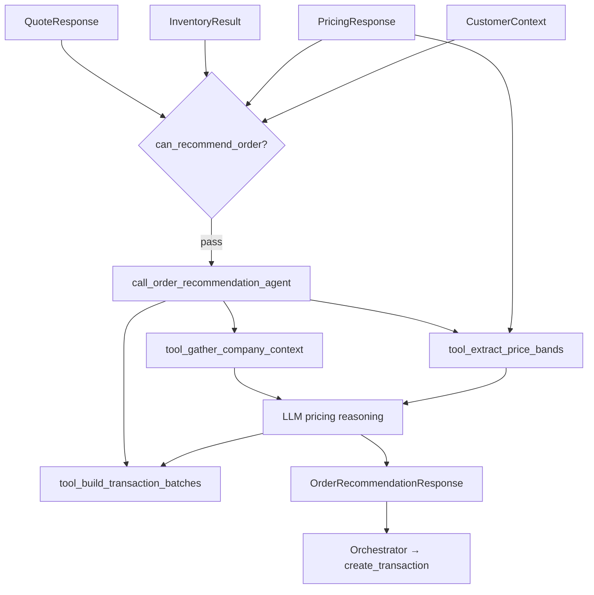

# Order Recommendation Agent — Specification & Test Plan

**Version:** 1.3  
**Date:** 2026-06-07  
**Phase:** 2E — Implemented  
**System Overview:** [../system_overview.md](../system_overview.md)  
**Upstream inputs:** [quoting_agent.md](quoting_agent.md) (`QuoteResponse`), [inventory_tool.md](../tools/inventory_tool.md) (`InventoryResult`), [pricing_tool.md](../tools/pricing_tool.md) (`PricingResponse`)

---

## Table of Contents

1. [Purpose](#1-purpose)
2. [Architecture](#2-architecture)
3. [File Layout](#3-file-layout)
4. [Output Schema](#4-output-schema)
5. [Pricing Policy](#5-pricing-policy)
6. [Primary Directive](#6-primary-directive)
7. [Tools](#7-tools)
8. [Input / Output Contract](#8-input--output-contract)
9. [Customer Response Format](#9-customer-response-format)
10. [Transaction Batches](#10-transaction-batches)
11. [Agent Definition Sketch](#11-agent-definition-sketch)
12. [Test Plan](#12-test-plan)
13. [Downstream Contract](#13-downstream-contract)

---

## 1. Purpose

Receive a successful quote pipeline handoff — structured quote, inventory check, and cash-validated pricing options — plus the **original customer request text** and customer context (`need_size`, `event_type`, `job_type`). The agent:

1. **Reasons** on final per-line unit selling prices using company financial health, inventory pressure, customer context, and the three strategy bands from [`PricingTool`](../tools/pricing_tool.md).
2. **Composes** a warm, professional `customer_response` in the style of historical quotes in `quotes.csv` (line-item breakdown, bulk discounts, rounded totals, delivery date).
3. **Returns** machine-readable `stock_orders` and `sales` transaction batches ready for the orchestrator to pass to [`create_transaction()`](../../project_starter.py).
4. **Documents** `pricing_justification` so the orchestrator can audit how the sale was priced.

The agent prioritizes **company profit** but willingly offers targeted discounts to keep customers happy. Best practice: **discount low-quantity lines** while **holding or raising price on high-quantity lines** within the allowed bands — making the customer happy on small items while maximizing margin on bulk lines.

---

## 2. Architecture

### Orchestrator placement



| Stage | Owner | Decides |
|---|---|---|
| Company context | `tool_gather_company_context` | Inventory snapshot, financial report, and inventory pressure in one call |
| Price bands | [`PricingResponse`](../tools/pricing_tool.md) | min / avg / max per line from three strategies |
| Final unit prices | LLM agent | One selling price per line within policy and bands |
| Customer prose | LLM agent | `customer_response` matching `quotes.csv` tone |
| Ledger payloads | LLM agent + validation | `stock_orders` on `date_of_request`; `sales` on `need_date` |

Step 5 in the orchestrator pipeline — after Pricing Tool, before Place Order Tool (or direct `create_transaction` calls).

---

## 3. File Layout

```
/workspace/
├── agents/
│   └── order_recommendation_agent.py   # Agent, tools, models, entry point
├── tests/
│   └── test_order_recommendation_agent.py   # OR-T* tool tests implemented
├── tools/
│   ├── inventory_tool.py
│   └── pricing_tool.py
├── project_starter.py                  # get_all_inventory, generate_financial_report, create_transaction
├── quotes.csv                        # Style reference for customer_response
├── quote_requests.csv                # need_size, event, job, mood columns
└── specification/
    └── agents/
        └── order_recommendation_agent.md   # This document
```

### Module-level constants

```python
MODEL = "openai:gpt-5.4-mini"

# Inventory pressure — agent leans discount when ordered SKUs hold a large share of on-hand stock
INVENTORY_PRESSURE_DISCOUNT_PCT = 15.0   # >= this → lean discount

# Financial stress — agent leans premium when cash is tight but inventory value is high
LOW_CASH_THRESHOLD = 500.0
HIGH_INVENTORY_VALUE_THRESHOLD = 2000.0

# Customer context
DISCOUNT_EVENTS = {"party", "festival", "gathering", "concert", "reception", "celebration", "exhibition", "show"}
DISCOUNT_NEED_SIZES = {"large"}
PREMIUM_NEED_SIZES = {"small"}

# Quantity tactic — compare to this threshold when applying per-line discount/premium
LOW_QUANTITY_THRESHOLD = 200
HIGH_QUANTITY_THRESHOLD = 500
```

---

## 4. Output Schema

```python
from typing import Literal, Optional
from pydantic import BaseModel, Field

class TransactionRecord(BaseModel):
    """One row ready for create_transaction()."""
    item_name: str
    transaction_type: Literal["stock_orders", "sales"]
    quantity: int = Field(gt=0)
    price: float = Field(gt=0, description="Total line price (not per-unit).")
    transaction_date: str = Field(description="YYYY-MM-DD")

class TransactionBatch(BaseModel):
    """Grouped transactions for one date."""
    transaction_date: str
    transactions: list[TransactionRecord] = Field(min_length=1)

class RecommendedLineItem(BaseModel):
    product_name: str
    quantity_requested: int
    quantity_fulfilled: int          # from PricingTool included lines
    quantity_in_stock: int           # from InventoryResult
    quantity_to_order: int           # from InventoryResult
    unit_cost: float                 # catalog cost
    unit_price: float                # final chosen selling price per unit
    line_total: float                # unit_price × quantity_fulfilled
    included: bool                   # False when PricingTool excluded for cash

class OrderRecommendationResponse(BaseModel):
    success: bool
    date_of_request: str
    need_date: str
    recommended_items: list[RecommendedLineItem]
    stock_orders: Optional[TransactionBatch] = None   # procurement on date_of_request; null when nothing to order
    sales: Optional[TransactionBatch] = None          # customer sale on need_date
    customer_response: str           # prose quote for the customer
    pricing_justification: str       # audit trail for orchestrator
    total_quote_amount: float        # sum of sales line totals
    error: Optional[str] = None
```

| Field | Type | Description |
|---|---|---|
| `recommended_items` | list | Final priced lines with inventory echo |
| `stock_orders` | `TransactionBatch` | Supplier orders dated `date_of_request` |
| `sales` | `TransactionBatch` | Customer sale dated `need_date` |
| `customer_response` | string | Friendly quote prose (see [§9](#9-customer-response-format)) |
| `pricing_justification` | string | Structured reasoning: financial, inventory, customer, per-line tactic |
| `total_quote_amount` | float | Rounded total charged to customer |

`success=false` only on catastrophic validation failure (missing dates, empty items, no includable lines).

---

## 5. Pricing Policy

The agent uses [`PricingResponse`](../tools/pricing_tool.md) as **bounds**, not as the final answer. For each included line, let:

| Band | Source |
|---|---|
| Floor | `maximize_turnover` recommendation `unit_price` for that product |
| Mid | `average_pricing` recommendation `unit_price` |
| Ceiling | `maximize_profit` recommendation `unit_price` |

Final `unit_price` must satisfy `floor <= unit_price <= ceiling` for included lines. Excluded lines (`included=false`) appear in `recommended_items` with `quantity_fulfilled=0` and are omitted from `sales`.

### 5.1 Inventory pressure (discount lean)

Use `inventory_pressure_pct` from `tool_gather_company_context`.

**Interpretation:** When ordered products already represent a **sizable share** of total on-hand inventory, the company should **move product** → lean toward the **floor** or below-mid band on affected SKUs.

```
inventory_pressure_pct = tool_compute_inventory_pressure result
if inventory_pressure_pct >= INVENTORY_PRESSURE_DISCOUNT_PCT:
    lean discount on lines where quantity_in_stock is high relative to request
```

### 5.2 Financial health (premium lean)

Use `cash_balance` and `inventory_value` from `tool_gather_company_context`.

When **`cash_balance` is low** AND **`inventory_value` is high**, the company needs cash and is sitting on stock → lean toward **ceiling** or above-mid band.

```
if cash_balance < LOW_CASH_THRESHOLD and inventory_value > HIGH_INVENTORY_VALUE_THRESHOLD:
    lean premium (closer to ceiling)
```

### 5.3 Customer `need_size`

From `CustomerContext.need_size` (maps to `need_size` column in `quote_requests.csv` / `order_size` in `quotes.csv` metadata):

| `need_size` | Pricing lean |
|---|---|
| `small` | Premium — closer to ceiling; less bulk discount rhetoric |
| `medium` | Neutral — mid band default |
| `large` | Discount — closer to floor; emphasize bulk savings in prose |

### 5.4 Event type

When `CustomerContext.event_type` is a social or public event (`party`, `festival`, `gathering`, `concert`, `reception`, `celebration`, `exhibition`, `show`), lean **discount** and mention supporting the event in `customer_response`.

### 5.5 Customer `mood`

From `CustomerContext.mood` (maps to the `mood` column in `quote_requests.csv` and `quote_requests_sample.csv`):

| Mood category | Example values | Pricing lean |
|---|---|---|
| Premium | `happy`, `cheerful`, `pleased`, `excited`, `delighted` | Closer to ceiling |
| Discount | `sad`, `miserable`, `stressed`, `pissed off`, `angry`, `upset`, `frustrated`, `unhappy`, `depressed` | Closer to floor |
| Unrecognized / absent | — | No mood lean applied |

When unit price deviates from the mid band, the agent must cite mood (when it drove the move) in `pricing_justification`.

### 5.6 Per-line quantity tactic (profit + happiness)

Within the band constraints:

| Line quantity | Tactic |
|---|---|
| `quantity_requested < LOW_QUANTITY_THRESHOLD` | Favor **discount** (customer-visible savings on small lines) |
| `LOW_QUANTITY_THRESHOLD <= quantity_requested < HIGH_QUANTITY_THRESHOLD` | **Mid** band |
| `quantity_requested >= HIGH_QUANTITY_THRESHOLD` | Favor **premium** (maximize margin on bulk) |

This implements: *discount low-quantity items, maximize price on high-quantity items* while staying inside strategy bands.

### 5.7 Priority order

When signals conflict, apply in this order:

1. **Hard bounds** — never below floor or above ceiling from Pricing Tool
2. **Cash stress** — low cash + high inventory → premium bias
3. **Inventory pressure** — high share → discount bias on stocked SKUs
4. **need_size / event / mood** — customer context adjustments
5. **Per-line quantity tactic** — fine-tune within remaining room
6. **Profit priority** — when ambiguous, choose the higher defensible price inside the band

---

## 6. Primary Directive

The agent follows this fixed step order (`ORDER_RECOMMENDATION_DIRECTIVE` in `agents/order_recommendation_agent.py`).

1. Validate `quote`, `inventory`, and `pricing` are present with dates and non-empty items. On failure return `success=false`.

2. Call `tool_gather_company_context` once with `date_of_request` and the list of `product_name` values from the quote. This returns inventory snapshot, financial report, and `inventory_pressure_pct` together. Use the result for all [Pricing Policy](#5-pricing-policy) signals in steps 5.1–5.2.

3. Call `tool_extract_price_bands` with `pricing` to get per-product `{floor, mid, ceiling, included, quantity_fulfilled}`.

4. Call `tool_evaluate_pricing_signals` with company context (step 2) and `customer`. Use lean flags when applying [Pricing Policy](#5-pricing-policy).

5. Choose one `unit_price` per line within `[floor, ceiling]`; document trade-offs in `pricing_justification`.

6. Build `recommended_items` — one entry per quote line with final `unit_price`, `line_total`, and inventory echo fields.

7. Call `tool_build_transaction_batches` with `date_of_request`, `need_date`, and `recommended_items`. Copy `stock_orders` and `sales` from the tool result.

8. Compose `customer_response` prose per [§9](#9-customer-response-format). Set `total_quote_amount` to the sum of sales transaction prices.

9. Call `tool_validate_order_recommendation` with draft `response` and `price_bands` from step 3. Return the validated result as final `OrderRecommendationResponse`.

**Hard rules:**
- Never invent products not in the quote.
- Never price outside the strategy band for included lines.
- `stock_orders` only for `quantity_to_order > 0`; `sales` only for `included` lines with `quantity_fulfilled > 0`.
- All transaction dates must be ISO `YYYY-MM-DD`.
- `pricing_justification` must cite which policy signals fired (inventory %, cash/inventory, need_size, event, quantity tactic).

---

## 7. Tools

### Implemented (in `agents/order_recommendation_agent.py`)

| Tool | Status |
|---|---|
| `tool_gather_company_context` | Implemented |
| `tool_extract_price_bands` | Implemented |
| `tool_evaluate_pricing_signals` | Implemented |
| `tool_build_transaction_batches` | Implemented |
| `tool_validate_order_recommendation` | Implemented |

### 7.1 `tool_gather_company_context` (deterministic — implemented)

Single call replacing separate inventory, financial, and pressure lookups (Primary Directive step 2). Pure Python internally delegates to `get_all_inventory`, `generate_financial_report`, and `compute_inventory_pressure`.

**Input:**

```python
class CompanyContextInput(BaseModel):
    date_of_request: str
    ordered_products: list[str]    # product_name values from quote.items
```

**Algorithm:**

```python
inventory = get_all_inventory(date_of_request)
financial = generate_financial_report(date_of_request)
pressure = compute_inventory_pressure(date_of_request, ordered_products)
```

**Output:**

```python
class CompanyContextResult(BaseModel):
    as_of_date: str
    inventory: dict[str, int]              # {item_name: stock}
    cash_balance: float
    inventory_value: float
    total_assets: float
    inventory_summary: list[dict]          # from generate_financial_report
    top_selling_products: list[dict]
    inventory_pressure_pct: float          # 0–100
    ordered_in_stock_units: int
    total_units: int
```

**Signature:**

```python
def tool_gather_company_context(payload: CompanyContextInput) -> dict:
    """Return inventory, financial health, and inventory pressure in one call."""
```

| Output field | Pricing policy use |
|---|---|
| `inventory` | Stock levels for ordered SKUs |
| `cash_balance` | Low-cash premium signal (§5.2) |
| `inventory_value` | High-inventory premium signal (§5.2) |
| `inventory_pressure_pct` | Discount lean when ≥ `INVENTORY_PRESSURE_DISCOUNT_PCT` (§5.1) |

**Internal helper (testable, not an agent tool):**

```python
def compute_inventory_pressure(
    date_of_request: str,
    ordered_products: list[str],
) -> dict:
    """% of total on-hand units held in ordered SKUs."""
    all_inventory = get_all_inventory(date_of_request)
    total_units = sum(all_inventory.values())
    if total_units == 0:
        return {"inventory_pressure_pct": 0.0, "ordered_in_stock_units": 0, "total_units": 0}
    ordered_in_stock_units = sum(all_inventory.get(p, 0) for p in ordered_products)
    return {
        "inventory_pressure_pct": round(100.0 * ordered_in_stock_units / total_units, 2),
        "ordered_in_stock_units": ordered_in_stock_units,
        "total_units": total_units,
    }
```

---

### 7.2 `tool_extract_price_bands` (deterministic — implemented)

Maps nested `PricingResponse.recommendations` to a flat per-product table. Avoids LLM mis-reading three strategy blocks.

```python
class PriceBand(BaseModel):
    product_name: str
    floor: float           # maximize_turnover unit_price
    mid: float             # average_pricing unit_price
    ceiling: float         # maximize_profit unit_price
    unit_cost: float
    quantity_fulfilled: int
    included: bool

def extract_price_bands(pricing: PricingResponse) -> list[PriceBand]:
    """Internal helper — raises ValueError if a strategy is missing."""

def tool_extract_price_bands(pricing: PricingResponse) -> list[dict]:
    """Agent tool wrapper returning list of PriceBand dicts."""
```

---

### 7.3 `tool_build_transaction_batches` (deterministic — implemented)

Builds `stock_orders` and `sales` from `recommended_items` with correct dates, quantities, and `price = unit × qty` rounding.

```python
class BuildTransactionsInput(BaseModel):
    date_of_request: str
    need_date: str
    recommended_items: list[RecommendedLineItem]   # min_length=1

class BuildTransactionsResult(BaseModel):
    stock_orders: Optional[TransactionBatch] = None   # null when quantity_to_order == 0 for all lines
    sales: Optional[TransactionBatch] = None          # null when no included fulfilled lines

def build_transaction_batches(payload: BuildTransactionsInput) -> BuildTransactionsResult:
    """Internal helper."""

def tool_build_transaction_batches(payload: BuildTransactionsInput) -> dict:
    """Return {stock_orders, sales} as dicts."""
```

---

### 7.4 `tool_evaluate_pricing_signals` (deterministic — implemented)

Evaluates policy thresholds from `CompanyContextResult` + `CustomerContext`.

```python
class PricingSignalsInput(BaseModel):
    company_context: CompanyContextResult
    customer: CustomerContext

class PricingSignalsResult(BaseModel):
    lean_discount_inventory: bool
    lean_premium_cash_stress: bool
    lean_discount_need_size: bool
    lean_premium_need_size: bool
    lean_discount_event: bool
    summary: str

def evaluate_pricing_signals(payload: PricingSignalsInput) -> PricingSignalsResult:
    """Internal helper."""

def tool_evaluate_pricing_signals(payload: PricingSignalsInput) -> dict:
    """Return PricingSignalsResult as a dict."""
```

---

### 7.5 `tool_validate_order_recommendation` (deterministic — implemented)

Thin safety net (like `tool_validate_quote_response` on Quoting Agent): band compliance, date format, line totals, sales sum vs `total_quote_amount`.

```python
class ValidateOrderRecommendationPayload(BaseModel):
    response: OrderRecommendationResponse
    price_bands: list[PriceBand]

def validate_order_recommendation(
    payload: ValidateOrderRecommendationPayload,
) -> OrderRecommendationResponse | OrderRecommendationValidationError:
    """Internal helper — returns error model on failure."""

def tool_validate_order_recommendation(payload_json: str) -> dict:
    """Validate draft response; return response dict or {"error": "..."}."""
```

---

### 7.6 Optional tools (not implemented)

| Priority | Tool | Why |
|---|---|---|
| **Low** | `tool_round_quote_total` | Deterministic friendly rounding for `customer_response`. |

**Agent tool list:**

```python
tools=[
    tool_gather_company_context,
    tool_extract_price_bands,
    tool_evaluate_pricing_signals,
    tool_build_transaction_batches,
    tool_validate_order_recommendation,
]
```

**Internal (testable):** `compute_inventory_pressure`, `gather_company_context`, `extract_price_bands`, `build_transaction_batches`, `evaluate_pricing_signals`, `validate_order_recommendation`

---

## 8. Input / Output Contract

### Input

```python
class CustomerContext(BaseModel):
    """Original customer request and metadata from quote_requests.csv."""
    original_request_text: str
    job_type: Optional[str] = None
    need_size: Optional[str] = None     # small | medium | large
    event_type: Optional[str] = None
    mood: Optional[str] = None

class OrderRecommendationRequest(BaseModel):
    quote: QuoteResponse
    inventory: InventoryResult
    pricing: PricingResponse
    customer: CustomerContext
```

The orchestrator passes `customer` from the original CSV row (`need_size`, `event`, `job`, `mood`) plus the raw request string (without or with the date suffix — agent uses `quote.date_of_request` for tool dates).

### Orchestrator gate

```python
def can_recommend_order(
    quote: QuoteResponse,
    inventory: InventoryResult,
    pricing: PricingResponse,
) -> bool:
    return (
        quote.success
        and quote.date_of_request is not None
        and quote.need_date is not None
        and len(quote.items) > 0
        and pricing.success
        and all(item.success for item in inventory.items)
        and any(
            item.included
            for rec in pricing.recommendations
            for item in rec.items
            if rec.strategy == "average_pricing"
        )
    )
```

### Invocation

```python
from agents.order_recommendation_agent import (
    call_order_recommendation_agent,
    OrderRecommendationRequest,
    CustomerContext,
    can_recommend_order,
)

if can_recommend_order(quote, inventory, pricing):
    recommendation = call_order_recommendation_agent(
        OrderRecommendationRequest(
            quote=quote,
            inventory=inventory,
            pricing=pricing,
            customer=CustomerContext(
                original_request_text=request_text,
                need_size=need_size,
                event_type=event_type,
                job_type=job_type,
                mood=mood,
            ),
        )
    )
```

---

## 9. Customer Response Format

Match the tone and structure of [`quotes.csv`](../../quotes.csv) — especially multi-line orders with bulk discounts (e.g. rows 53–58).

### Required elements

1. **Opening** — thank the customer; reference their event or need when `event_type` / `need_size` is known.
2. **Line-item breakdown** — for each fulfilled product: quantity, unit price, and line subtotal.
3. **Discount narrative** — when policy leans discount, explain bulk savings, event support, or rounded totals.
4. **Total** — state final amount (may be a friendly rounded figure; align with `total_quote_amount`).
5. **Delivery** — confirm supplies arrive by `need_date`.

### Style examples (from `quotes.csv`)

**Large order, bulk discount (row 53):**

> Thank you for your order for the upcoming gathering! I'm pleased to provide a bulk discount on your request… The breakdown includes 500 reams of standard letter-sized paper at $0.06 each, 200 reams of cardstock at $0.15 each… Given the large volume of your order, I have rounded the total…

**Itemized discounts (row 56):**

> …For the order of 500 reams of A4 printer paper, the normal cost would be $25.00, but I'm offering it at $23.00 for bulk ordering… Altogether, your adjusted total is a very pleasing $137.00.

**Small order with bulk language (row 57):**

> …unit price for A4 paper is $0.05… However, since you're ordering in bulk… we can offer a bulk discount which adjusts the pricing to a nice round total of $50.00.

### Prohibited

- Raw JSON or internal field names in `customer_response`
- Mentioning `cash_balance`, tool names, or strategy literals (`maximize_profit`)
- Quoting prices outside `recommended_items`

---

## 10. Transaction Batches

Each `TransactionRecord` maps 1:1 to [`create_transaction()`](../../project_starter.py):

```python
create_transaction(
    item_name=record.item_name,
    transaction_type=record.transaction_type,
    quantity=record.quantity,
    price=record.price,           # total line amount
    date=record.transaction_date,
)
```

### 10.1 `stock_orders` batch

| Field | Rule |
|---|---|
| `transaction_date` | `quote.date_of_request` |
| `transaction_type` | `"stock_orders"` |
| Lines | Only where `quantity_to_order > 0` |
| `quantity` | `quantity_to_order` from `InventoryResult` |
| `price` | `unit_cost × quantity` (catalog cost, not selling price) |

**Example:**

```json
{
  "transaction_date": "2025-04-01",
  "transactions": [
    {
      "item_name": "A4 paper",
      "transaction_type": "stock_orders",
      "quantity": 400,
      "price": 20.0,
      "transaction_date": "2025-04-01"
    }
  ]
}
```

### 10.2 `sales` batch

| Field | Rule |
|---|---|
| `transaction_date` | `quote.need_date` |
| `transaction_type` | `"sales"` |
| Lines | Only included lines with `quantity_fulfilled > 0` |
| `quantity` | `quantity_fulfilled` from pricing recommendation |
| `price` | `unit_price × quantity_fulfilled` (chosen selling price) |

**Example:**

```json
{
  "transaction_date": "2025-04-10",
  "transactions": [
    {
      "item_name": "A4 paper",
      "transaction_type": "sales",
      "quantity": 500,
      "price": 25.0,
      "transaction_date": "2025-04-10"
    }
  ]
}
```

### 10.3 Orchestrator execution order

1. Post all `stock_orders` transactions on `date_of_request` (fund supplier replenishment).
2. Post all `sales` transactions on `need_date` (record customer revenue).

The Place Order Tool (Phase 2F) may wrap step 1; until then the orchestrator calls `create_transaction` directly from `stock_orders`.

---

## 11. Agent Definition Sketch

```python
order_recommendation_agent = Agent(
    "openai:gpt-5.4-mini",
    system_prompt=ORDER_RECOMMENDATION_DIRECTIVE,
    output_type=OrderRecommendationResponse,
    tools=[
        tool_gather_company_context,
        tool_extract_price_bands,
        tool_evaluate_pricing_signals,
        tool_build_transaction_batches,
        tool_validate_order_recommendation,
    ],
)

def call_order_recommendation_agent(
    request: OrderRecommendationRequest,
) -> OrderRecommendationResponse:
    if not can_recommend_order(request.quote, request.inventory, request.pricing):
        return failure response without LLM call
    return order_recommendation_agent.run_sync(request.model_dump_json()).output
```

**Public exports:** `OrderRecommendationResponse`, `OrderRecommendationRequest`, `CustomerContext`, `customer_context_from_csv_row`, `TransactionBatch`, `TransactionRecord`, `call_order_recommendation_agent`, `can_recommend_order`

**Internal (testable):** `compute_inventory_pressure`, `gather_company_context`

---

## 12. Test Plan

Scenarios in `tests/test_order_recommendation_agent.py`.

```bash
source /workspace/.venv/bin/activate
PYTHONPATH=/workspace python tests/test_order_recommendation_agent.py
```

Mock `get_all_inventory` and `generate_financial_report` via module patches. **OR-T\*** and **OR-E\*** gate tests run against implemented tools directly — no LLM, no API key. **11/11** tool/gate scenarios passing in `tests/test_order_recommendation_agent.py`.

### 12.1 Happy path

| ID | Scenario | Key assertions |
|---|---|---|
| OR-H1 | Standard multi-line order | `success=true`; `sales` + `stock_orders` populated; prose mentions delivery date |
| OR-H2 | All stock in hand (`quantity_to_order=0`) | Empty or absent `stock_orders`; `sales` only |
| OR-H3 | Large `need_size` + gathering event | Discount lean; prose mentions bulk / event |

### 12.2 Policy signals

| ID | Scenario | Key assertions |
|---|---|---|
| OR-P1 | High inventory pressure (≥15%) | `unit_price` closer to floor than ceiling |
| OR-P2 | Low cash + high inventory value | `unit_price` closer to ceiling |
| OR-P3 | `need_size=small` | Premium lean vs OR-P4 |
| OR-P4 | `need_size=large` | Discount lean |
| OR-P5 | Low-qty line + high-qty line on same order | Low qty discounted more aggressively than high qty |

### 12.3 Transactions

| ID | Scenario | Key assertions |
|---|---|---|
| OR-TX1 | Mixed stock and order | `stock_orders` on `date_of_request`; `sales` on `need_date` |
| OR-TX2 | `create_transaction` field mapping | Each record has valid `item_name`, `quantity`, `price`, `transaction_type` |
| OR-TX3 | Sales total matches `total_quote_amount` | Sum of sales `price` equals `total_quote_amount` (± rounding) |

### 12.4 Tool-level (deterministic)

| ID | Scenario | Key assertions |
|---|---|---|
| OR-T1 | `compute_inventory_pressure` — 20% share | `inventory_pressure_pct == 20.0` |
| OR-T2 | Empty warehouse | `inventory_pressure_pct == 0.0` |
| OR-T3 | Unknown product names | Treated as 0 stock; no error |
| OR-T4 | `tool_gather_company_context` | Returns inventory + financial + pressure in one payload |
| OR-T5 | `tool_extract_price_bands` | Floor ≤ mid ≤ ceiling per product |
| OR-T6 | `tool_build_transaction_batches` | Sales on `need_date`; stock_orders on `date_of_request` |
| OR-T6b | All stock in hand | `stock_orders` is null; `sales` populated |
| OR-T7 | `tool_evaluate_pricing_signals` | Low cash + high inventory → `lean_premium_cash_stress=true` |
| OR-T8 | `tool_validate_order_recommendation` | Rejects `unit_price` above ceiling |
| OR-T8b | Valid in-band response | Validation passes |

### 12.5 Edge cases

| ID | Scenario | Key assertions |
|---|---|---|
| OR-E1 | `pricing.success=false` | Gate blocks; `success=false` if forced |
| OR-E2 | All lines cash-excluded | `success=false`; non-null `error` |
| OR-E3 | Missing `need_date` | `success=false` |

---

## 13. Downstream Contract

### To orchestrator / `create_transaction`

```python
from project_starter import create_transaction

for record in recommendation.stock_orders.transactions:
    create_transaction(
        item_name=record.item_name,
        transaction_type=record.transaction_type,
        quantity=record.quantity,
        price=record.price,
        date=record.transaction_date,
    )

for record in recommendation.sales.transactions:
    create_transaction(
        item_name=record.item_name,
        transaction_type=record.transaction_type,
        quantity=record.quantity,
        price=record.price,
        date=record.transaction_date,
    )
```

### To customer

Return `recommendation.customer_response` as the final quote text. Optionally persist alongside `total_quote_amount` and `pricing_justification` for audit.

### From upstream components

| Source | Fields used |
|---|---|
| `QuoteResponse` | `date_of_request`, `need_date`, `items[]` |
| `InventoryResult` | `quantity_in_stock`, `quantity_to_order` per line |
| `PricingResponse` | Strategy bands, `included`, `quantity_fulfilled` |
| `CustomerContext` | `original_request_text`, `need_size`, `event_type`, `job_type`, `mood` |

See [system_overview.md](../system_overview.md) for the full seven-step orchestrator pipeline.
