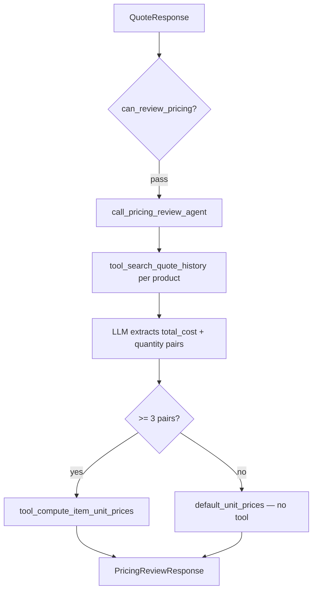

# Pricing Review Agent — Specification & Test Plan

**Version:** 1.2  
**Date:** 2026-06-07  
**Phase:** 2D — Implemented  
**System Overview:** [../system_overview.md](../system_overview.md)  
**Upstream input:** [quoting_agent.md](quoting_agent.md) (`QuoteResponse`)

---

## Table of Contents

1. [Purpose](#1-purpose)
2. [Architecture](#2-architecture)
3. [File Layout](#3-file-layout)
4. [Output Schema](#4-output-schema)
5. [Primary Directive](#5-primary-directive)
6. [Tools](#6-tools)
7. [Input / Output Contract](#7-input--output-contract)
8. [Agent Definition Sketch](#8-agent-definition-sketch)
9. [Test Plan](#9-test-plan)
10. [Downstream Contract](#10-downstream-contract)

---

## 1. Purpose

Receive a successful [`QuoteResponse`](quoting_agent.md) and, for each line item, search historical quotes to determine **minimum, average, and maximum unit selling prices** observed in past orders.

The agent does not set a final customer price. It produces structured price bands that feed directly into [`PricingTool.price()`](../tools/pricing_tool.md) as `ItemUnitPrices`.

Callers use `call_pricing_review_agent()` and receive a `PricingReviewResponse`. The agent has **exactly two tools**:

1. `tool_search_quote_history` — fetch historical quote records per product
2. `tool_compute_item_unit_prices` — deterministic division and min/avg/max (only when history is sufficient)

The LLM extracts **total cost and quantity** pairs from `quote_explanation` prose. It never divides costs by quantities itself and never computes min/avg/max.

**Threshold:** Call `tool_compute_item_unit_prices` only when **three or more** usable `{total_cost, quantity}` pairs exist for an item. Fewer than three uses `default_unit_prices()` from [`pricing_tool.py`](../../tools/pricing_tool.py) (not a tool call), with a per-item `error`. **All three price fields are always required** on every item.

**Floor:** `min_unit_price` is never less than `unit_cost × 0.85` (`MIN_UNIT_PRICE_FLOOR` in `pricing_tool.py`), whether from history or fallback.

---

## 2. Architecture

### Orchestrator placement



| Stage | Owner | Decides |
|---|---|---|
| History lookup | `tool_search_quote_history` | Matching past quote records per product name |
| Pair extraction | LLM (in agent run) | `{total_cost, quantity}` per historical line for the target product |
| Unit price bands | `tool_compute_item_unit_prices` | `total_cost ÷ quantity` → min / avg / max (only when ≥ 3 pairs) |
| Insufficient history | Agent + `default_unit_prices` | `DEFAULT_STRATEGY_MULTIPLIERS` fallback; per-item `error` |
| Min price floor | `tool_compute_item_unit_prices` / `default_unit_prices` | `min_unit_price >= unit_cost × 0.85` |

Catalog `unit_cost` comes from `QuoteItem.unit_price` and is echoed on the response.

---

## 3. File Layout

```
/workspace/
├── agents/
│   └── pricing_review_agent.py     # Agent, tools, models, entry point
├── tests/
│   └── test_pricing_review_agent.py
├── tools/
│   └── pricing_tool.py             # ItemUnitPrices, default_unit_prices, MIN_UNIT_PRICE_FLOOR
├── project_starter.py              # search_quote_history
└── specification/
    └── agents/
        └── pricing_review_agent.md # This document
```

### Module-level constants

```python
MODEL = "openai:gpt-5.4-mini"

MIN_HISTORY_ORDERS = 3
HISTORY_SEARCH_LIMIT = 20

# Fallback only — not agent tools
from tools.pricing_tool import default_unit_prices
```

---

## 4. Output Schema

```python
from typing import Optional
from pydantic import BaseModel

class ItemPriceReview(BaseModel):
    product_name: str
    unit_cost: float                    # catalog cost from QuoteItem.unit_price
    history_count: int                  # usable {total_cost, quantity} pairs extracted
    min_unit_price: float               # always set; floored at unit_cost × 0.85
    avg_unit_price: float               # always set
    max_unit_price: float               # always set
    error: Optional[str] = None         # non-null when history_count < MIN_HISTORY_ORDERS

class PricingReviewResponse(BaseModel):
    success: bool
    date_of_request: str
    items: list[ItemPriceReview]
```

**`ItemPriceReview` maps 1:1 to `ItemUnitPrices`** on [`PricingTool`](../tools/pricing_tool.md) — same four price fields plus `product_name`.

| Field | Type | Description |
|---|---|---|
| `product_name` | string | Catalog product name |
| `unit_cost` | float | `QuoteItem.unit_price` |
| `history_count` | int | Number of usable `{total_cost, quantity}` pairs |
| `min_unit_price` | float | Minimum derived unit price; never below `unit_cost × 0.85` |
| `avg_unit_price` | float | Average derived unit price |
| `max_unit_price` | float | Maximum derived unit price |
| `error` | string or null | Non-null when fallback used (`history_count < 3`); `null` when tool computed bands |

`success=false` only on catastrophic failure (missing dates, empty items).

---

## 5. Primary Directive

The agent follows this fixed step order (`PRICING_REVIEW_DIRECTIVE` in `agents/pricing_review_agent.py`).

1. Validate `date_of_request` is set and `items` is non-empty. On failure return `success=false`.

2. For **each** `QuoteItem`, call `tool_search_quote_history([product_name], limit=HISTORY_SEARCH_LIMIT)`.

3. From each returned record's `quote_explanation`, extract **line-level** `{total_cost, quantity}` pairs for that product only:
   - **Use:** `"500 sheets at $0.05 each"` → `{total_cost: 25.0, quantity: 500}` or `{total_cost: 0.05, quantity: 1}` when per-unit is explicit (quantity = 1, total_cost = unit price).
   - **Use:** `"$25 for the A4 white paper"` with `"500 sheets"` → `{total_cost: 25.0, quantity: 500}`.
   - **Ignore:** order-level rounded totals, bulk discount percentages, amounts not tied to the target product.
   - One historical quote may yield at most one pair per product mentioned.

4. Set `history_count = len(line_costs)` for the product.

5. **If `history_count >= MIN_HISTORY_ORDERS` (3):** call `tool_compute_item_unit_prices` with `product_name`, `unit_cost`, and `line_costs`. Copy `min_unit_price`, `avg_unit_price`, `max_unit_price`, and `history_count` from the tool result. Set `error = null`.

6. **If `history_count < MIN_HISTORY_ORDERS`:** do **not** call `tool_compute_item_unit_prices`. Call `default_unit_prices(product_name, unit_cost)` in Python and copy the three prices. Set `error` (e.g. `"Only 2 historical orders found; need at least 3. Used DEFAULT_STRATEGY_MULTIPLIERS."`).

7. Return `PricingReviewResponse` with `success=true` when all items are reviewed.

**Hard rules:**
- Exactly **two** agent tools — no others.
- One `tool_search_quote_history` call per distinct `product_name`.
- `tool_compute_item_unit_prices` is called **only** when `history_count >= 3` for that item.
- The LLM never divides `total_cost` by `quantity` and never computes min/avg/max.
- Never invent pairs not supported by `quote_explanation` text.

---

## 6. Tools

The agent exposes **exactly two tools**.

### 6.1 `tool_search_quote_history` (data)

| Wraps | Role |
|---|---|
| `search_quote_history(search_terms, limit)` | Historical quotes matching product name |

Thin wrapper — returns list of dicts with `quote_explanation`, `total_amount`, `order_date`, etc.

### 6.2 `tool_compute_item_unit_prices` (deterministic)

Pure Python. Called by the agent when it has **≥ `MIN_HISTORY_ORDERS` (3)** usable pairs; the tool itself computes from any valid input (≥ 1 pair with `quantity > 0`).

**Input:**

```python
class HistoricalLineCost(BaseModel):
    total_cost: float       # line total for the product in one historical quote
    quantity: int           # units for that line; must be > 0

class ComputeItemUnitPricesInput(BaseModel):
    product_name: str
    unit_cost: float        # catalog cost — used for min price floor
    line_costs: list[HistoricalLineCost]   # at least one entry with quantity > 0
```

**Algorithm:**

```python
from tools.pricing_tool import clamp_min_unit_price

unit_prices = [
    round(entry.total_cost / entry.quantity, 2)
    for entry in line_costs
    if entry.quantity > 0
]

if not unit_prices:
    return {"error": "No valid line_costs with quantity > 0."}

min_unit_price = clamp_min_unit_price(unit_cost, min(unit_prices))
max_unit_price = round(max(unit_prices), 2)
avg_unit_price = round(sum(unit_prices) / len(unit_prices), 2)
```

**Output** (maps directly to `ItemUnitPrices` / `ItemPriceReview`):

```python
{
    "product_name": str,
    "history_count": int,
    "min_unit_price": float,
    "avg_unit_price": float,
    "max_unit_price": float,
}
```

**Signature:**

```python
def tool_compute_item_unit_prices(payload: ComputeItemUnitPricesInput) -> dict:
    """Derive min/avg/max unit prices from historical line costs and quantities."""
    return compute_item_unit_prices(payload).model_dump()
```

The LLM passes extracted `{total_cost, quantity}` pairs as typed `line_costs` on
`ComputeItemUnitPricesInput` — not prose and not a JSON string wrapper.

### 6.3 Fallback (not an agent tool)

When `history_count < MIN_HISTORY_ORDERS`, the agent calls `default_unit_prices(product_name, unit_cost)` from `tools/pricing_tool.py`:

```python
# min = max(unit_cost × 0.92, unit_cost × 0.85)
# avg = unit_cost × 1.05
# max = unit_cost × 1.20
```

### 6.4 Mandatory tool tests

| Tool | Min tests |
|---|---|
| `tool_search_quote_history` | 1 happy path (mocked delegate) |
| **`tool_compute_item_unit_prices`** | PR-T1–PR-T4 (Section 9.4) |

---

## 7. Input / Output Contract

### Input

```python
class PricingReviewRequest(BaseModel):
    quote: QuoteResponse
```

### Orchestrator gate

```python
def can_review_pricing(quote: QuoteResponse) -> bool:
    return (
        quote.success
        and quote.date_of_request is not None
        and len(quote.items) > 0
    )
```

### Invocation

```python
from agents.pricing_review_agent import (
    call_pricing_review_agent,
    PricingReviewRequest,
    can_review_pricing,
)

if can_review_pricing(quote):
    review = call_pricing_review_agent(PricingReviewRequest(quote=quote))
```

---

## 8. Agent Definition Sketch

```python
pricing_review_agent = Agent(
    "openai:gpt-5.4-mini",
    system_prompt=PRICING_REVIEW_DIRECTIVE,
    output_type=PricingReviewResponse,
    tools=[
        tool_search_quote_history,
        tool_compute_item_unit_prices,
    ],
)

def call_pricing_review_agent(request: PricingReviewRequest) -> PricingReviewResponse:
    # Pre-validates quote; runs LLM agent; applies default_unit_prices fallback in Python
    return pricing_review_agent.run_sync(request.model_dump_json()).output
```

**Public exports:** `PricingReviewResponse`, `ItemPriceReview`, `PricingReviewRequest`, `call_pricing_review_agent`, `can_review_pricing`

**Internal (testable):** `compute_item_unit_prices`

---

## 9. Test Plan

Scenarios in `tests/test_pricing_review_agent.py`.

```bash
source /workspace/.venv/bin/activate
PYTHONPATH=/workspace python tests/test_pricing_review_agent.py
```

Mock `search_quote_history` via module patches. **PR-T* run against `compute_item_unit_prices` directly** — no LLM, no API key.

### 9.1 Happy path

| ID | Scenario | Key assertions |
|---|---|---|
| PR-H1 | ≥3 historical line_cost pairs | Tool called; `min` < `avg` < `max`; `error=null` |
| PR-H2 | Multi-item quote, mixed history depth | Tool called only for items with ≥3 pairs |
| PR-H3 | Exactly 3 pairs | `history_count=3`; tool called once |

### 9.2 Insufficient history

| ID | Scenario | Key assertions |
|---|---|---|
| PR-I1 | 2 historical pairs | Tool **not** called; fallback multipliers; non-null `error` |
| PR-I2 | 0 history hits | Tool **not** called; fallback; non-null `error` |
| PR-I3 | Tool not invoked when count < 3 | Agent test mocks tool; assert zero calls |

### 9.3 Edge cases

| ID | Scenario | Key assertions |
|---|---|---|
| PR-E1 | Empty `quote.items` | `success=false` |
| PR-E2 | Missing `date_of_request` | `success=false` |

### 9.4 Tool-level (`tool_compute_item_unit_prices`)

| ID | Scenario | Key assertions |
|---|---|---|
| PR-T1 | `[{25, 500}, {30, 500}, {27.5, 500}]` | min=0.05, max=0.06, avg=0.055 → rounded 0.06 |
| PR-T2 | 3 pairs where min/unit < 0.85× unit_cost | `min_unit_price` clamped to floor |
| PR-T3 | 2 valid pairs in input | Computes min/avg/max; agent still only calls when ≥ 3 |
| PR-T3b | No valid pairs (empty or quantity=0) | Returns error |
| PR-T4 | `quantity=0` entry skipped; still ≥3 valid | Computes from valid entries only |

**PR-T1 example** (`unit_cost=0.05`):

| total_cost | quantity | unit_price |
|---|---|---|
| 25.00 | 500 | 0.05 |
| 30.00 | 500 | 0.06 |
| 27.50 | 500 | 0.055 |

→ min=0.05, max=0.06, avg=0.06 (rounded)

---

## 10. Downstream Contract

### To Pricing Tool

`ItemPriceReview` fields map directly to `ItemUnitPrices`:

```python
from tools.pricing_tool import ItemUnitPrices, PricingRequest, PricingTool

unit_prices = [
    ItemUnitPrices(
        product_name=item.product_name,
        min_unit_price=item.min_unit_price,
        avg_unit_price=item.avg_unit_price,
        max_unit_price=item.max_unit_price,
    )
    for item in pricing_review.items
]

pricing = PricingTool().price(
    PricingRequest(quote=quote, inventory=inventory, unit_prices=unit_prices)
)
```

| Strategy | `unit_price` source |
|---|---|
| `maximize_profit` | `max_unit_price` |
| `average_pricing` | `avg_unit_price` |
| `maximize_turnover` | `min_unit_price` |

### To Order Recommendation Agent

Pricing Review output feeds the Pricing Tool, which produces strategy bands consumed by the Order Recommendation Agent. See [order_recommendation_agent.md](order_recommendation_agent.md).

| Field | Use |
|---|---|
| `items[].min_unit_price` | Lower pricing band (via Pricing Tool `maximize_turnover`) |
| `items[].avg_unit_price` | Mid pricing band (via Pricing Tool `average_pricing`) |
| `items[].max_unit_price` | Upper pricing band (via Pricing Tool `maximize_profit`) |
| `items[].error` | Signals fallback was used for that item |

See [system_overview.md](../system_overview.md) for the full orchestrator pipeline.
