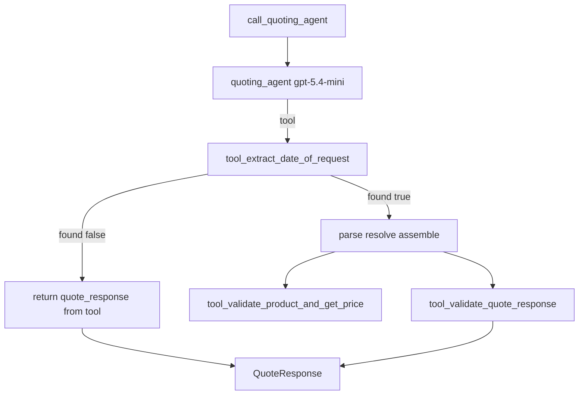

# Quoting Agent — Specification & Test Plan

**Version:** 1.5  
**Date:** 2026-06-06  
**Phase:** 1 — In Progress  
**System Overview:** [../system_overview.md](../system_overview.md)

---

## Table of Contents

1. [Purpose](#1-purpose)
2. [Architecture](#2-architecture)
3. [File Layout](#3-file-layout)
4. [Output Schema](#4-output-schema)
5. [Primary Directive](#5-primary-directive)
6. [Tools](#6-tools)
7. [Input / Output Contract](#7-input--output-contract)
8. [Agent Definition Sketch](#8-agent-definition-sketch)
9. [Test Plan](#9-test-plan)
10. [Downstream Contract (Inventory Tool)](#10-downstream-contract-inventory-tool)

---

## 1. Purpose

Receive a natural-language customer request — formatted as `request_with_date = f"{row['request']} (Date of request: {request_date})"` — and return a **structured response** that the orchestration layer can act on directly.

The agent does not return a prose quote. It parses the request into machine-readable fields that downstream agents (inventory, ordering) and the test harness can consume without further parsing.

When `success=True`, the `QuoteResponse` envelope (`need_date`, `date_of_request`, `items[]`) is the input contract for the deterministic [Inventory Tool](../tools/inventory_tool.md) (Phase 2).

Callers use `call_quoting_agent()` and receive a `QuoteResponse`. Internally, a single pydantic-ai agent on `gpt-5.4-mini` coordinates deterministic **tools** for date extraction, catalog lookup, and response validation.

---

## 2. Architecture



| Stage | Owner | Decides |
|---|---|---|
| Quoting agent | LLM (`gpt-5.4-mini`) | Parse, resolve, assemble; tool call sequence |
| E1 failure | Tool | `quote_response` embedded in extract tool when `found=False` |
| Catalog lookup | Tool | `tool_validate_product_and_get_price` |
| Safety check | Tool | `tool_validate_quote_response` |

Deterministic business rules for E1 and catalog grounding live in **tools**. The LLM assembles the draft `QuoteResponse` and invokes the validation tool before returning.

---

## 3. File Layout

```
/workspace/
├── agents/
│   └── quoting_agent.py        # Agent, tools, models, entry point
├── tests/
│   └── test_quoting_agent.py   # Runnable test scenarios (H1–H3, E1–E5)
└── specification/
    └── agents/
        └── quoting_agent.md    # This document
```

---

## 4. Output Schema

```python
from pydantic import BaseModel, field_validator
from typing import Optional

class QuoteItem(BaseModel):
    product_name: str
    quantity_requested: int
    unit_price: float

class QuoteResponse(BaseModel):
    success: bool
    error: Optional[str] = None
    date_of_request: Optional[str] = None
    need_date: Optional[str] = None
    items: list[QuoteItem] = []

    @field_validator("date_of_request", "need_date", mode="before")
    @classmethod
    def validate_date_format(cls, v):
        if v is None:
            return v
        import re
        if not re.match(r"^\d{4}-\d{2}-\d{2}$", v):
            raise ValueError(f"Date must be YYYY-MM-DD, got: {v!r}")
        return v
```

| Field | Type | Description |
|---|---|---|
| `success` | bool | `true` only when `date_of_request`, `need_date`, and at least one valid item are present with no errors |
| `error` | string or null | Problem description; `null` on full success |
| `date_of_request` | string (YYYY-MM-DD) or null | From `(Date of request: ...)` suffix |
| `need_date` | string (YYYY-MM-DD) or null | Delivery / need-by date in request body |
| `items` | list[QuoteItem] | Valid resolved line items; empty when all missing quantities (E3) |

`success=false` when: missing date suffix (E1), missing need date (E2), missing quantities (E3), or unrecognized products (E5). Partial `items[]` allowed for E2 and E5.

---

## 5. Primary Directive

The agent follows a fixed step order (`QUOTING_DIRECTIVE` in `agents/quoting_agent.py`):

1. `tool_extract_date_of_request`
2. If `found=False` → return embedded `quote_response`; stop
3. Parse `cleaned_quote` (need_date, items with nullable quantities)
4. Resolve catalog matches via `tool_validate_product_and_get_price`
5. Assemble draft `QuoteResponse` (success/error rules)
6. `tool_validate_quote_response`
7. Return validated output

---

## 6. Tools

| Tool | Role |
|---|---|
| `tool_extract_date_of_request` | Regex date suffix extraction; includes `quote_response` when `found=False` (E1) |
| `tool_validate_product_and_get_price` | Full catalog or single-product lookup |
| `tool_validate_quote_response` | Catalog grounding and success/error invariants |

All tools are pure Python — no LLM calls inside tool bodies. Catalog data comes from `paper_supplies` in `project_starter.py`.

---

## 7. Input / Output Contract

**Input:**

```python
request_with_date = f"{row['request']} (Date of request: {request_date})"
```

**Invocation:**

```python
from agents.quoting_agent import call_quoting_agent, QuoteResponse

response: QuoteResponse = call_quoting_agent(request_with_date)
```

**Output:** validated `QuoteResponse` Pydantic object.

---

## 8. Agent Definition Sketch

```python
quoting_agent = Agent(
    "openai:gpt-5.4-mini",
    system_prompt=QUOTING_DIRECTIVE,
    output_type=QuoteResponse,
    tools=[
        tool_extract_date_of_request,
        tool_validate_product_and_get_price,
        tool_validate_quote_response,
    ],
)

def call_quoting_agent(request_with_date: str) -> QuoteResponse:
    return quoting_agent.run_sync(request_with_date).output
```

**Public exports:** `QuoteResponse`, `QuoteItem`, `call_quoting_agent`

**Internal:** `quoting_agent` instance (for tests inspecting tool logs)

---

## 9. Test Plan

Scenarios in `tests/test_quoting_agent.py` — H1–H3 (happy path), E1–E5 (edge cases).

```bash
PYTHONPATH=/workspace python tests/test_quoting_agent.py
```

E2 and E3 assert `success=False` and non-null `error` (exact wording not tested).

### E5 — unrecognized product mixed with valid

**Input:**
```
"I need 200 sheets of A4 paper, 100 balloons, and 50 envelopes. Needed by April 20, 2025. (Date of request: 2025-04-05)"
```

**Expected:** `success=False`, partial items (A4 paper, Envelopes only); `"balloons"` must not be substituted.

---

## 10. Downstream Contract (Inventory Tool)

The orchestrator passes a subset of `QuoteResponse` to [InventoryTool.check()](../tools/inventory_tool.md) via `quote_to_inventory_request()`. Field names align with no renames — only null filtering and list mapping.

### Minimum inputs required by Inventory Tool

| Required field | Type | Source on `QuoteResponse` |
|---|---|---|
| `date_of_request` | `str` (`YYYY-MM-DD`) | `date_of_request` |
| `need_date` | `str` (`YYYY-MM-DD`) | `need_date` |
| `items[].product_name` | `str` | `QuoteItem.product_name` |
| `items[].quantity_requested` | `int` | `QuoteItem.quantity_requested` |
| `items[].unit_price` | `float` | `QuoteItem.unit_price` |

`QuoteResponse.success` and `QuoteResponse.error` are **not** inventory inputs — the orchestrator uses them for routing only.

### Field mapping

```python
InventoryRequest(
    need_date=quote.need_date,           # must be non-null at call time
    date_of_request=quote.date_of_request,
    items=[
        RequestedItem(
            product_name=item.product_name,
            quantity_requested=item.quantity_requested,
            unit_price=item.unit_price,
        )
        for item in quote.items
    ],
)
```

### Orchestrator gate

The orchestrator must not call inventory when required fields are missing. **Strict gate (default):**

```python
def can_check_inventory(quote: QuoteResponse) -> bool:
    return (
        quote.success
        and quote.date_of_request is not None
        and quote.need_date is not None
        and len(quote.items) > 0
    )
```

When `success=True`, quoting rules (Section 5, step 5) guarantee all minimum inventory inputs are populated.

**Optional partial gate (E5 — resolved items only, quote-level failure):**

```python
def can_check_inventory_partial(quote: QuoteResponse) -> bool:
    return (
        quote.date_of_request is not None
        and quote.need_date is not None
        and len(quote.items) > 0
    )
```

| Scenario | Inventory callable? |
|---|---|
| H1–H4 | **Yes** |
| E1 | **No** — missing dates and items |
| E2 | **No** — `need_date` null |
| E3 | **No** — empty items |
| E5 | **Optional** — orchestrator policy; minimum inputs present for resolved lines |

No additional quoting output fields are required for inventory. See [system_overview.md](../system_overview.md) Phase 3 handoff for the full orchestration flow.
