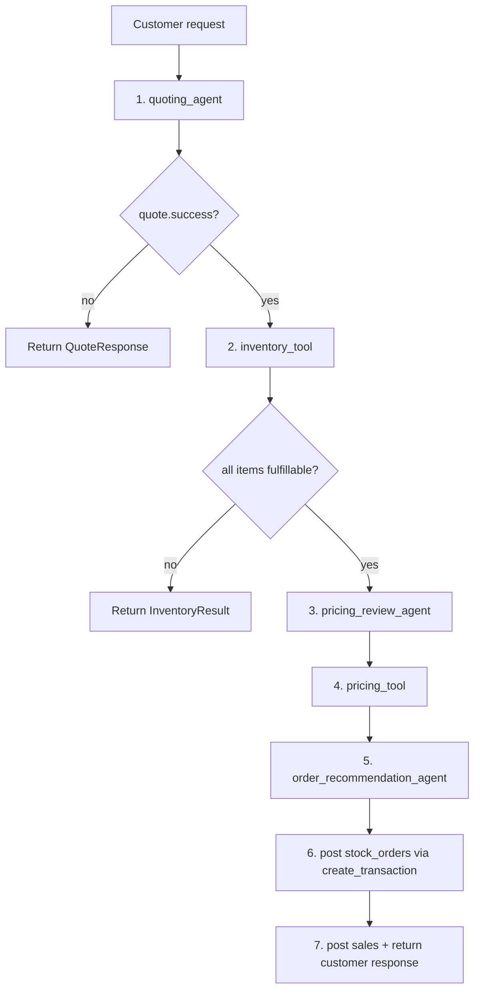
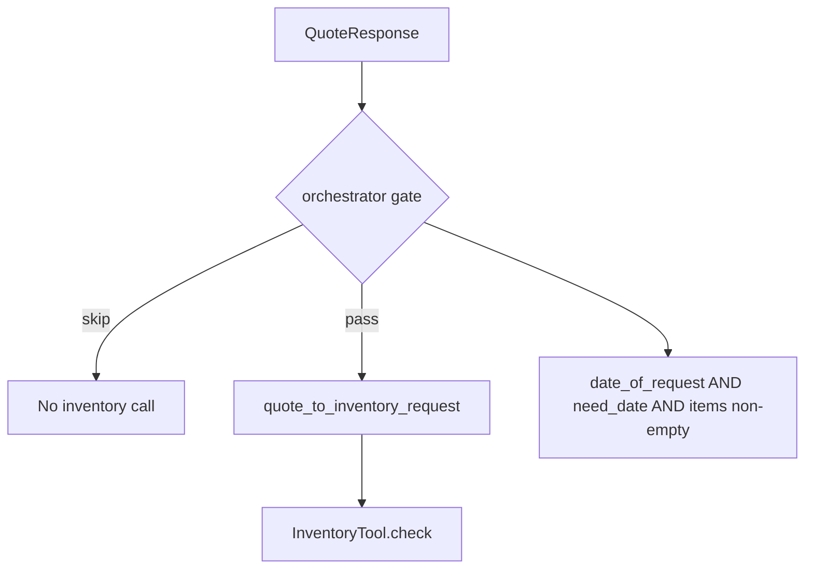

# Munder Difflin — Multi-Agent System Overview

**Version:** 1.9  
**Date:** 2026-06-08  
**Status:** Phases 1–3 implemented (full pipeline through orchestrator)

---

## Table of Contents

1. [Project Overview](#1-project-overview)
2. [Architecture](#2-architecture)
3. [Integration Contract](#3-integration-contract)
4. [Future Phases](#4-future-phases)
5. [Environment Setup](#5-environment-setup)
6. [Conventions](#6-conventions)

### Component Specifications

| Component | File | Status |
|---|---|---|
| Quoting Agent | [agents/quoting_agent.md](agents/quoting_agent.md) | Phase 1 — In Progress |
| Inventory Tool | [tools/inventory_tool.md](tools/inventory_tool.md) | Phase 2 — Implemented |
| Pricing Review Agent | [agents/pricing_review_agent.md](agents/pricing_review_agent.md) | Phase 2D — Implemented |
| Pricing Tool | [tools/pricing_tool.md](tools/pricing_tool.md) | Phase 2C — Implemented |
| Order Recommendation Agent | [agents/order_recommendation_agent.md](agents/order_recommendation_agent.md) | Phase 2E — Implemented |
| Place Order Tool | [tools/place_order_tool.md](tools/place_order_tool.md) | Phase 2F — Pending |
| Orchestrator Agent | [agents/orchestrator_agent.md](agents/orchestrator_agent.md) | Phase 3 — Implemented |

---

## 1. Project Overview

**Munder Difflin** is a paper supply company simulator. The system manages inventory, processes customer quote requests, places stock orders, and maintains a financial ledger — all backed by a SQLite database.

### Goal

Build a **multi-agent system** using the [`pydantic-ai`](https://ai.pydantic.dev/) Python library that handles the full customer-request lifecycle:

1. A customer submits a natural-language quote request (e.g., "I need 500 sheets of A4 paper for a conference by April 15").
2. The system routes the request to the appropriate sub-agent(s).
3. The sub-agents consult inventory, pricing history, and business rules to produce a structured quote or take an action.
4. The result is returned to the caller and logged.

### Build Strategy

Agents are built **one at a time**, each fully tested before the next begins. Once all agents are complete, a top-level orchestration layer wires them together. The final step integrates the system into `project_starter.py` via clean imports.

### Existing Foundation (`project_starter.py`)

The starter file provides:

| Function | Description |
|---|---|
| `init_database(db_engine, seed)` | Creates all tables and seeds initial data |
| `create_transaction(item_name, type, qty, price, date)` | Appends a stock order or sale to the ledger |
| `get_all_inventory(as_of_date)` | Returns `{item_name: stock}` for all in-stock items |
| `get_stock_level(item_name, as_of_date)` | Returns a DataFrame with current stock for one item |
| `get_cash_balance(as_of_date)` | Returns net cash (sales minus purchases) |
| `generate_financial_report(as_of_date)` | Returns a full financial snapshot dict |
| `search_quote_history(search_terms, limit)` | Searches past quotes by keyword |
| `get_supplier_delivery_date(date_str, quantity)` | Estimates delivery date based on order size |

Database tables:

| Table | Contents |
|---|---|
| `transactions` | All stock orders and sales with dates, quantities, prices |
| `inventory` | Reference catalog of items with unit prices |
| `quotes` | Past generated quotes with amounts and explanations |
| `quote_requests` | Original customer requests with metadata (`mood`, `job`, `need_size`, `event`, `response`) |

---

## 2. Architecture

### Multi-Agent Flow

```
Customer Request
      │
      ▼
┌─────────────────────────────┐
│   orchestrator_agent        │  ← seven-step ReAct quote-to-order pipeline
│   (Thought → Action → Observe) │
└──────────┬──────────────────┘
           │
     1. quoting_agent          → QuoteResponse
     2. inventory_tool         → InventoryResult
     3. pricing_review_agent   → PricingReviewResponse
     4. pricing_tool           → PricingResponse (cash validation)
     5. order_recommendation_agent → OrderRecommendationResponse
     6. post stock_orders       → create_transaction on date_of_request
     7. post sales + response   → create_transaction on need_date; customer prose
           │
           ▼
         SQLite DB (via project_starter.py functions)
```

See [Orchestrator Pipeline](#orchestrator-pipeline) for the full handoff contract.

### Framework

- **Library:** `pydantic-ai` — `Agent` for individual agents with typed tools and structured output
- **LLM:** OpenAI `gpt-5.4-mini` (Quoting Agent, Pricing Review Agent); deterministic tools have no LLM
- **Provider:** `openai` via `OPENAI_API_KEY`
- **Tool calling:** Plain Python functions passed to `Agent(..., tools=[...])`
- **Schema enforcement:** Pydantic `output_type` on the agent (default tool-output mode validates against the model schema)
- **Orchestrator:** ReAct agent in `agents/orchestrator_agent.py` — fixed step order via tools; Thought before each Action

### Quoting Agent Internals (Phase 1)

The Quoting Agent module exposes `call_quoting_agent()` and runs a single pydantic-ai agent on `gpt-5.4-mini`:

1. **`tool_extract_date_of_request`** — regex extraction of `(Date of request: ...)`; embeds E1 `quote_response` when missing
2. **Agent LLM work** — parse need_date and line items, resolve catalog matches via tools, assemble draft `QuoteResponse`
3. **`tool_validate_product_and_get_price`** — catalog list or exact name lookup
4. **`tool_validate_quote_response`** — thin safety net for catalog grounding and success/error invariants

The entry point is one agent run — no Python pipeline outside the agent loop.

### Pricing Review Agent Internals (Phase 2D)

The Pricing Review Agent module exposes `call_pricing_review_agent()` and runs a pydantic-ai agent on `gpt-5.4-mini`:

1. **`tool_search_quote_history`** — wraps `search_quote_history`; one call per distinct `product_name`
2. **Agent LLM work** — reads `quote_explanation` prose from history and extracts `{total_cost, quantity}` pairs per product; counts `history_count`
3. **`tool_compute_item_unit_prices`** — typed `ComputeItemUnitPricesInput`; divides `total_cost ÷ quantity` → min / avg / max with `MIN_UNIT_PRICE_FLOOR` clamp; **no minimum history check** (pure math on whatever pairs the agent passes)
4. **Agent threshold (`MIN_HISTORY_ORDERS = 3`)** — agent calls the compute tool only when `history_count >= 3`; otherwise applies `DEFAULT_STRATEGY_MULTIPLIERS` fallback in the response with a per-item `error`
5. **Post-run normalization** — `_normalize_review_response()` aligns `unit_cost` with the quote and fills any missing products; does not override agent fallback decisions

The entry point is one agent run. Pre-validation (`date_of_request`, non-empty `items`) returns `success=false` without calling the LLM.

### Phased Build Plan

| Phase | Deliverable | Status |
|---|---|---|
| 1 | Quoting Agent + tests | In Progress |
| 2 | Inventory Tool + tests | Implemented |
| 2C | Pricing Tool + tests | Implemented |
| 2D | Pricing Review Agent + tests | Implemented |
| 2E | Order Recommendation Agent + tests | Implemented |
| 2F | Place Order Tool + tests | Pending |
| 3 | Orchestrator Agent (`agents/orchestrator_agent.py`) | Implemented |
| 4 | Integration into `project_starter.py` | Implemented |

---

## 3. Integration Contract

### Design Principle

Each agent module exposes **two public objects**: a typed entry-point function (`call_<agent>()`) and its corresponding Pydantic response model. All tools, directives, agent configuration, and schema definitions are encapsulated inside the agent module. `project_starter.py` only sees the typed functions and models — it never calls the agent runner directly or touches raw dicts.

### Orchestration Pattern

The orchestrator agent is a **ReAct** pydantic-ai agent that chains typed components in a fixed order. At each step the LLM records a **Thought**, calls one tool (**Action**), and reads the result (**Observation**). Step order is **mandatory** — the directive forbids skip/reorder. This provides:
- **Predictable pipeline** — same seven steps for every customer quote request
- **Type safety** — every boundary returns a Pydantic model, not a raw dict
- **Easy debugging** — orchestration logic is plain Python, readable and testable in isolation

### Orchestrator Pipeline

The orchestrator agent handles a customer quote request end-to-end:



| Step | Component | Built? | Purpose |
|---|---|---|---|
| 1 | [Quoting Agent](agents/quoting_agent.md) | Yes | Parse natural-language request into `QuoteResponse` |
| 2 | [Inventory Tool](tools/inventory_tool.md) | Yes | Validate fulfillment from stock; compute `quantity_to_order` |
| 3 | [Pricing Review Agent](agents/pricing_review_agent.md) | Yes | LLM extracts historical line costs; min / avg / max per item (compute tool when ≥3 pairs) |
| 4 | [Pricing Tool](tools/pricing_tool.md) | Yes | Validate `cash_balance` covers procurement; three strategy recommendations |
| 5 | [Order Recommendation Agent](agents/order_recommendation_agent.md) | Yes | Final unit prices, customer prose, stock_orders + sales batches |
| 6 | Post stock (`create_transaction`) | Spec | Supplier `stock_orders` on `date_of_request` |
| 7 | Post sales + response | Spec | Customer `sales` on `need_date`; return `OrchestratorResponse` |

**Sketch (`agents/orchestrator_agent.py`):**

```python
from agents.quoting_agent import call_quoting_agent, QuoteResponse
from agents.pricing_review_agent import call_pricing_review_agent, PricingReviewRequest, can_review_pricing
from tools.inventory_tool import InventoryTool, quote_to_inventory_request
from tools.pricing_tool import ItemUnitPrices, PricingTool, PricingRequest, can_price
# from agents.order_recommendation_agent import call_order_recommendation_agent, ...
# from tools.place_order_tool import PlaceOrderTool, ...

def handle_quote_request(request_with_date: str) -> ...:
    quote: QuoteResponse = call_quoting_agent(request_with_date)
    if not quote.success:
        return quote

    if not can_check_inventory(quote):
        return quote

    inventory = InventoryTool().check(quote_to_inventory_request(quote))
    if not all(item.success for item in inventory.items):
        return inventory

    if can_review_pricing(quote):
        pricing_review = call_pricing_review_agent(PricingReviewRequest(quote=quote))

    unit_prices = [
        ItemUnitPrices(
            product_name=item.product_name,
            min_unit_price=item.min_unit_price,
            avg_unit_price=item.avg_unit_price,
            max_unit_price=item.max_unit_price,
        )
        for item in pricing_review.items
    ]

    if can_price(quote, inventory):
        pricing = PricingTool().price(
            PricingRequest(quote=quote, inventory=inventory, unit_prices=unit_prices)
        )

    # order_recommendation = call_order_recommendation_agent(...)
    # place_order = PlaceOrderTool().place(...)
    # return final customer response
```

### Phase 3 Handoff: QuoteResponse → InventoryTool

When the orchestrator handles a quote request, it may chain quoting to inventory. The orchestrator must **not** pass every `QuoteResponse` to inventory — it gates on required fields first.



**Flow:**

```python
from agents.quoting_agent import call_quoting_agent, QuoteResponse
from tools.inventory_tool import InventoryTool, quote_to_inventory_request

quote: QuoteResponse = call_quoting_agent(request_with_date)

if can_check_inventory(quote):
    inventory_result = InventoryTool().check(quote_to_inventory_request(quote))
```

**Strict gate (default — matches successful quotes):**

```python
def can_check_inventory(quote: QuoteResponse) -> bool:
    return (
        quote.success
        and quote.date_of_request is not None
        and quote.need_date is not None
        and len(quote.items) > 0
    )
```

When `success=True`, quoting rules guarantee all minimum inventory inputs are populated (see [quoting_agent.md](agents/quoting_agent.md)).

**Scenario routing:**

| Scenario | Inventory callable? |
|---|---|
| H1–H4 (`success=True`) | **Yes** — full minimum inputs |
| E1 missing suffix | **No** — missing dates and items |
| E2 missing need date | **No** — `need_date` required |
| E3 missing qty | **No** — empty items |
| E5 partial failure | **Optional** — dates and partial items present; orchestrator policy choice |

**Optional partial gate (E5 — check stock for resolved items even when quote failed):**

```python
def can_check_inventory_partial(quote: QuoteResponse) -> bool:
    return (
        quote.date_of_request is not None
        and quote.need_date is not None
        and len(quote.items) > 0
    )
```

`quote_to_inventory_request()` raises `ValueError` if dates are null or items are empty — callers must satisfy the gate before mapping. See [inventory_tool.md](tools/inventory_tool.md).

### Phase 3 Handoff: QuoteResponse → Pricing Review Agent

After inventory confirms every line is fulfillable, the orchestrator calls the Pricing Review Agent **before** the Pricing Tool.

```python
from agents.pricing_review_agent import call_pricing_review_agent, PricingReviewRequest, can_review_pricing

if can_review_pricing(quote):
    pricing_review = call_pricing_review_agent(PricingReviewRequest(quote=quote))
```

For each product, the LLM agent searches `search_quote_history`, extracts `{total_cost, quantity}` pairs from `quote_explanation` prose, and calls `tool_compute_item_unit_prices` when it counts **three or more** usable pairs. Fewer than three uses multiplier fallback (agent decision, not enforced in the compute tool). See [pricing_review_agent.md](agents/pricing_review_agent.md).

**Gate:**

```python
def can_review_pricing(quote: QuoteResponse) -> bool:
    return (
        quote.success
        and quote.date_of_request is not None
        and len(quote.items) > 0
    )
```

**Handoff to Pricing Tool** — map `ItemPriceReview` → `ItemUnitPrices` (all three price fields required on every item, whether from history or fallback).

### Phase 3 Handoff: QuoteResponse + InventoryResult → Pricing Tool

After pricing review, the orchestrator calls the Pricing Tool to validate cash and produce strategy recommendations.

```python
from tools.pricing_tool import ItemUnitPrices, PricingTool, PricingRequest, can_price

unit_prices = [
    ItemUnitPrices(
        product_name=item.product_name,
        min_unit_price=item.min_unit_price,
        avg_unit_price=item.avg_unit_price,
        max_unit_price=item.max_unit_price,
    )
    for item in pricing_review.items
]

if can_price(quote, inventory):
    pricing = PricingTool().price(
        PricingRequest(quote=quote, inventory=inventory, unit_prices=unit_prices)
    )
```

Cash-constrained procurement subset selection is **fully deterministic** — one profit-maximizing subset is selected and applied to all three strategy recommendations. See [pricing_tool.md](tools/pricing_tool.md).

### Phase 3 Handoff: Pricing → Order Recommendation Agent

After pricing, the orchestrator calls the Order Recommendation Agent with the quote, inventory result, pricing response, and customer context from `quote_requests.csv`.

```python
from agents.order_recommendation_agent import (
    call_order_recommendation_agent,
    OrderRecommendationRequest,
    CustomerContext,
    can_recommend_order,
)

if can_recommend_order(quote, inventory, pricing):
    recommendation = call_order_recommendation_agent(
        OrderRecommendationRequest(
            quote=quote,
            inventory=inventory,
            pricing=pricing,
            customer=CustomerContext(
                original_request_text=request_text,
                need_size=need_size,
                event_type=event_type,
                job_type=job_type,
                mood=mood,  # from quote_requests.csv / quote_requests_sample.csv
            ),
        )
    )
```

The agent returns final unit prices, `customer_response` prose (style of `quotes.csv`), and `stock_orders` / `sales` JSON batches for `create_transaction`. See [order_recommendation_agent.md](agents/order_recommendation_agent.md).

### Phase 3 Handoff: Order Recommendation → Ledger posting

The orchestrator posts transactions from `OrderRecommendationResponse` via `create_transaction` (see [orchestrator_agent.md](agents/orchestrator_agent.md) §9):

1. **Stock orders** — each `stock_orders` record on `date_of_request`.
2. **Sales** — each `sales` record on `need_date`.

A future Place Order Tool (Phase 2F) may wrap step 1; v1 uses posting tools inside the orchestrator.

### Phase 4 Integration Pattern

When the orchestrator is implemented, `project_starter.py` is updated as follows:

```python
# project_starter.py — Phase 4 additions (top of file)
from agents.orchestrator_agent import CustomerContext, OrchestratorRequest, handle_quote_request
```

Inside `run_test_scenarios()`:

```python
response = handle_quote_request(
    OrchestratorRequest(
        request_with_date=request_with_date,
        customer=customer_context_from_csv_row(row),  # includes mood when present
    )
)
print(f"Response: {response}")  # str(response) → customer_response prose
```

### Readability Contract

- Typed entry-point names match their role: `call_quoting_agent`, `call_pricing_review_agent`, `PricingTool.price`, `call_order_recommendation_agent`, `handle_quote_request`
- Orchestrator ReAct loop uses one tool per pipeline step — fixed order, explicit Thought before each Action
- No logic leaks into `project_starter.py` — business logic stays in `agents/` and `tools/`
- `project_starter.py` sees only `handle_quote_request` — one import, one call site; `str(response)` prints customer prose

---

## 4. Future Phases

Phases 1, 2, 2C, and 2D are implemented — see [Architecture](#2-architecture) and each component spec. Remaining work:

### Phase 2E: Order Recommendation Agent — Implemented

**Purpose:** Choose final per-line selling prices using financial health, inventory pressure, customer context, and Pricing Tool strategy bands; compose `customer_response` prose; return `stock_orders` and `sales` batches for `create_transaction`.

**Inputs:** `QuoteResponse`, `InventoryResult`, `PricingResponse`, `CustomerContext` (original request + CSV metadata)

**Tools:** `tool_gather_company_context`, `tool_extract_price_bands`, `tool_evaluate_pricing_signals`, `tool_build_transaction_batches`, `tool_validate_order_recommendation`

**Outputs:** `OrderRecommendationResponse` with `stock_orders`, `sales`, `customer_response`, `pricing_justification`

**Spec file:** [specification/agents/order_recommendation_agent.md](agents/order_recommendation_agent.md)

**Integration:** Orchestrator step 5 — after Pricing Tool; orchestrator posts transactions from `stock_orders` / `sales` (or delegates to Place Order Tool for procurement).

---

### Phase 2F: Place Order Tool

**Purpose:** Place supplier stock orders for `quantity_to_order` lines, record transactions, and confirm delivery estimates.

**Planned delegates:** `create_transaction`, `get_supplier_delivery_date`, `get_cash_balance`

**Spec file:** `specification/tools/place_order_tool.md` _(to be created)_

**Planned integration:** Orchestrator step 6 — after Order Recommendation Agent.

---

### Phase 3: Orchestrator Agent — Spec complete

**Purpose:** Provide a single ReAct entry point that runs the seven-step quote-to-order pipeline: quote → inventory → pricing review → pricing → order recommendation → post stock → post sales.

**Design:**
- `handle_quote_request(OrchestratorRequest)` drives Thought → Action → Observation at each step
- `tool_post_stock_transactions` / `tool_post_sales_transactions` call `create_transaction` on `date_of_request` and `need_date` respectively
- Returns `OrchestratorResponse` with `customer_response` for `project_starter.py` (`str(response)` for print/CSV)
- Early exit: `success=false`, `step_completed` set, human-readable `customer_response`
- Spec file: [specification/agents/orchestrator_agent.md](agents/orchestrator_agent.md)

**Optional NLP classifier (future):** If multiple request types are needed beyond quotes, a lightweight classifier can infer routing. This is additive and does not alter the typed component interfaces.

---

## 5. Environment Setup

### Python Environment

```bash
# Activate virtual environment (created during initial setup)
source /workspace/.venv/bin/activate

# Install pydantic-ai
pip install pydantic-ai

# Verify
python -c "from pydantic_ai import Agent; print('pydantic-ai OK')"
```

### `.env` File

Create `/workspace/.env` with the following keys:

```env
# Required for OpenAI provider
OPENAI_API_KEY=sk-...

# Optional: future providers
# ANTHROPIC_API_KEY=...
# GEMINI_API_KEY=...
```

The starter file loads this automatically via `import dotenv` / `dotenv.load_dotenv()`.

### Required Packages (`requirements.txt`)

```
pandas==2.2.3
typing==3.7.4.3
openai==1.76.0
SQLAlchemy==2.0.40
python-dotenv==1.1.0
pydantic>=2.0
pydantic-ai
```

### Project Structure

```
/workspace/
├── .env                          # API keys (not committed)
├── .venv/                        # Virtual environment
├── agents/
│   ├── quoting_agent.py          # Phase 1 — built
│   ├── pricing_review_agent.py   # Phase 2D — built
│   ├── order_recommendation_agent.py  # Phase 2E — built
│   └── orchestrator_agent.py     # Phase 3 — spec complete
├── tools/
│   ├── inventory_tool.py         # Phase 2 — built
│   ├── pricing_tool.py           # Phase 2C — built
│   └── place_order_tool.py       # Phase 2F — pending
├── specification/
│   ├── system_overview.md        # This document
│   ├── tools/
│   │   ├── inventory_tool.md
│   │   ├── pricing_tool.md
│   │   └── place_order_tool.md   # pending
│   └── agents/
│       ├── quoting_agent.md
│       ├── pricing_review_agent.md
│       └── order_recommendation_agent.md
├── tests/
│   ├── test_quoting_agent.py
│   ├── test_inventory_tool.py
│   ├── test_pricing_tool.py
│   ├── test_pricing_review_agent.py
│   └── test_order_recommendation_agent.py
├── munder_difflin.db             # SQLite database (generated at runtime)
├── project_starter.py            # Unchanged until Phase 4
├── quote_requests.csv
├── quote_requests_sample.csv
├── quotes.csv
├── requirements.txt
└── specification.md              # Index — links to specification/ folder
```

---

## 6. Conventions

### Agent Files

- One file per agent: `agents/<agent_name>.py`
- Each file exposes **two public objects**:
  1. A typed entry-point function: `call_<agent_name>(...) -> <AgentResponse>`
  2. The Pydantic response model: `<AgentName>Response` (and any nested models)
- LLM agents (`quoting_agent`, `pricing_review_agent`) run via `Agent.run_sync()` inside `call_<agent_name>()`; deterministic tools (`InventoryTool`, `PricingTool`) expose a class method instead
- The `Agent` instance (e.g. `quoting_agent`) is module-level but considered internal; only tests that inspect tool call logs need it directly
- Policy thresholds enforced by the agent directive (e.g. `MIN_HISTORY_ORDERS`) stay in the agent module; pure math helpers (e.g. `compute_item_unit_prices`) do not duplicate agent policy
- All constants (directives, thresholds, model names) are defined at the top of the file as named variables

### Tool Functions

- All tool functions are prefixed `tool_`
- Each tool has a complete Google-style docstring: description, `Args:`, `Returns:`
- Tools do not perform direct SQL; they delegate to `project_starter.py` functions
- Tool parameters use explicit type annotations

### Test Files

- One test file per agent: `tests/test_<agent_name>.py`
- Each scenario is a standalone function: `def test_h1_standard_in_stock_order():`
- Tests print scenario ID and pass/fail result to stdout
- Tests use a seeded, isolated database (not the production `munder_difflin.db`)

### Specification Files

- One spec file per agent: `specification/agents/<agent_name>.md`
- Deterministic shared tools: `specification/tools/<tool_name>.md`
- Each agent spec covers: Purpose, File Layout, Output Schema, Primary Directive, Tools, Input/Output Contract, Agent Definition Sketch, Test Plan
- `specification/system_overview.md` covers cross-cutting concerns only — no agent-specific detail

### Imports into `project_starter.py`

- Agent imports appear as a single grouped block near the top of the file
- `handle_quote_request` is the only orchestrator call site in `project_starter.py`
- No agent logic is defined inside `project_starter.py` — only one import block and one call site
