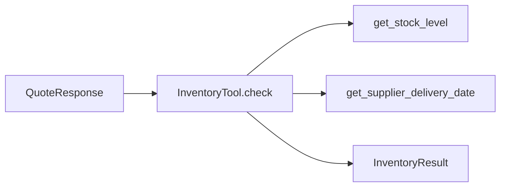
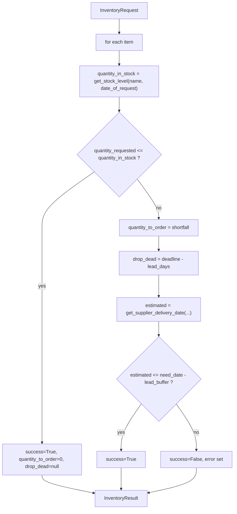

# Inventory Tool — Specification & Test Plan

**Version:** 1.1  
**Date:** 2026-06-07  
**Phase:** 2 — Pending (deterministic tool; no LLM)  
**System Overview:** [../system_overview.md](../system_overview.md)  
**Upstream input:** [../agents/quoting_agent.md](../agents/quoting_agent.md) (`QuoteResponse`)

---

## Table of Contents

1. [Overview](#1-overview)
2. [Project Layout](#2-project-layout)
3. [Pydantic Models](#3-pydantic-models)
4. [Dependencies](#4-dependencies)
5. [Data Sources](#5-data-sources)
6. [Class Interface](#6-class-interface)
7. [Processing Pipeline](#7-processing-pipeline)
8. [Error Handling](#8-error-handling)
9. [Examples](#9-examples)
10. [Assumptions](#10-assumptions)
11. [Deliverable Files](#11-deliverable-files)
12. [Test Plan](#12-test-plan)
13. [Reference Decision Logic](#13-reference-decision-logic)
14. [Running Tests](#14-running-tests)

---

## 1. Overview

This specification defines the **`InventoryTool`** class — a **deterministic** component (no AI/LLM calls). It receives the structured output of a successful quote from the [Quoting Agent](../agents/quoting_agent.md) and, for every line item, decides whether the requested quantity can be fulfilled by `need_date` — either from stock on hand or by a supplier order that arrives at least one day before `need_date`.

### Input (from `QuoteResponse`)

Only these fields are used (typically when `QuoteResponse.success is True`):

| Field | Type | Source |
|---|---|---|
| `need_date` | string (`YYYY-MM-DD`) | Quoting agent |
| `date_of_request` | string (`YYYY-MM-DD`) | Quoting agent |
| `items` | list | Each `QuoteItem` with `product_name`, `quantity_requested`, `unit_price` |

### Output (`InventoryResult`)

Same envelope with each item enriched:

| Field | Description |
|---|---|
| `product_name`, `quantity_requested`, `unit_price` | Echoed from input |
| `success` | `True` if the item can be fulfilled by `need_date` |
| `quantity_in_stock` | Stock observed via `get_stock_level` as of `date_of_request` |
| `quantity_to_order` | Units to order from supplier (`0` if stock covers request) |
| `drop_dead_stock_date` | Latest ISO order date (`YYYY-MM-DD`) to still deliver by `need_date - lead_buffer_days`; `null` when `quantity_to_order == 0` |
| `error` | Empty when `success` is `True`; otherwise explains why |

This document is self-contained: a developer can implement `tools/inventory_tool.py` and `tests/test_inventory_tool.py` using only this spec plus [`project_starter.py`](../../project_starter.py) for data-function behavior.



---

## 2. Project Layout

### 2.1 Files produced

```
/workspace/
├── tools/
│   └── inventory_tool.py       # Models + InventoryTool class
├── tests/
│   └── test_inventory_tool.py  # HP/SP scenarios (Section 12)
├── project_starter.py          # get_stock_level, get_supplier_delivery_date
└── specification/tools/
    └── inventory_tool.md   # This document
```

### 2.2 Imports (top of `tools/inventory_tool.py`)

```python
from datetime import date, timedelta

from pydantic import BaseModel, Field

from project_starter import get_stock_level, get_supplier_delivery_date
```

Tests mock `get_stock_level` via the constructor; production code uses the real functions above.

### 2.3 Environment

`InventoryTool` makes no network or LLM calls. It does **not** require `OPENAI_API_KEY` or `.env` loading.

### 2.4 Module-level constants

```python
DEFAULT_LEAD_BUFFER_DAYS = 1  # supplier order must arrive at least this many days before need_date
```

---

## 3. Pydantic Models

### 3.1 Public models

```python
from typing import Optional

class RequestedItem(BaseModel):
    """One line item from QuoteResponse.items."""
    product_name: str = Field(description="Exact catalog product name.")
    quantity_requested: int = Field(description="Units requested by the customer.")
    unit_price: float = Field(description="Per-unit price from the catalog.")

class InventoryRequest(BaseModel):
    """Subset of QuoteResponse passed to the inventory tool."""
    need_date: str = Field(description="Required delivery date, YYYY-MM-DD.")
    date_of_request: str = Field(description="Date the request was submitted, YYYY-MM-DD.")
    items: list[RequestedItem] = Field(default_factory=list)

class CheckedItem(BaseModel):
    """RequestedItem enriched with the inventory decision."""
    product_name: str
    quantity_requested: int
    unit_price: float
    success: bool = False
    quantity_in_stock: int = 0
    quantity_to_order: int = 0
    drop_dead_stock_date: Optional[str] = None  # YYYY-MM-DD; null when quantity_to_order == 0
    error: str = ""

class InventoryResult(BaseModel):
    """Full enriched envelope returned by InventoryTool.check()."""
    need_date: str
    date_of_request: str
    items: list[CheckedItem] = Field(default_factory=list)
```

### 3.2 Mapping from Quoting Agent

```python
from agents.quoting_agent import QuoteResponse

def quote_to_inventory_request(quote: QuoteResponse) -> InventoryRequest:
    """Map QuoteResponse → InventoryRequest. Fail fast on invalid orchestrator handoff."""
    if quote.date_of_request is None:
        raise ValueError("date_of_request is required for inventory check")
    if quote.need_date is None:
        raise ValueError("need_date is required for inventory check")
    if not quote.items:
        raise ValueError("items must be non-empty for inventory check")

    return InventoryRequest(
        need_date=quote.need_date,
        date_of_request=quote.date_of_request,
        items=[
            RequestedItem(
                product_name=item.product_name,
                quantity_requested=item.quantity_requested,
                unit_price=item.unit_price,
            )
            for item in quote.items
        ],
    )
```

The orchestrator must gate before calling this helper (see [quoting_agent.md](../agents/quoting_agent.md) Section 10 and [system_overview.md](../system_overview.md) Phase 3 handoff). The tool does **not** read `QuoteResponse.success` — that is an orchestrator routing concern only.

Helper may live in `tools/inventory_tool.py` or the future Inventory Agent module.

### 3.3 Internal models

None. The tool is fully deterministic.

---

## 4. Dependencies

From [`requirements.txt`](../../requirements.txt):

| Package | Use |
|---|---|
| `pydantic>=2.0` | Models |
| `pandas==2.2.3` | `get_stock_level` returns a DataFrame; tests build mock DataFrames |
| `SQLAlchemy==2.0.40` | Used indirectly via `project_starter.db_engine` when not mocked |

Standard library: `datetime`.

No model, API key, or `.env` configuration is required. Behavior is controlled by constructor arguments (Section 5.3).

---

## 5. Data Sources

Decisions use two functions from [`project_starter.py`](../../project_starter.py). The constructor accepts overrides so tests can supply deterministic mocks.

### 5.1 `get_stock_level(item_name, as_of_date) -> pd.DataFrame`

Returns a DataFrame with columns `item_name` and `current_stock` — net stock (`stock_orders` minus `sales`) up to and including `as_of_date`.

The tool reads `int(df["current_stock"].iloc[0])`. An empty DataFrame or missing row is treated as stock `0`.

**Call site:** `get_stock_level(product_name, date_of_request)` — stock is evaluated as of the request date.

The seeded database is random (`init_database(seed=...)`), so **tests MUST mock** this function (Section 12).

### 5.2 `get_supplier_delivery_date(input_date_str, quantity) -> str`

Returns estimated delivery date (`YYYY-MM-DD`) for an order of `quantity` units placed on `input_date_str`:

| Order quantity | Lead time (calendar days added) |
|---|---|
| ≤ 10 units | 0 (same day) |
| 11–100 units | 1 |
| 101–1000 units | 4 |
| > 1000 units | 7 |

Deterministic (no database). Tests may use the real implementation.

**Call site:** `get_supplier_delivery_date(date_of_request, quantity_to_order)` — order placed on the request date.

### 5.3 Constructor overrides

```python
def __init__(
    self,
    stock_fn=None,
    delivery_date_fn=None,
    lead_buffer_days: int = DEFAULT_LEAD_BUFFER_DAYS,
) -> None: ...
```

- `stock_fn` defaults to `get_stock_level`
- `delivery_date_fn` defaults to `get_supplier_delivery_date`
- `lead_buffer_days` default `1` — supplier must arrive at least one calendar day before `need_date`
- Tests pass a mock `stock_fn` and keep the real `delivery_date_fn`

---

## 6. Class Interface

```python
class InventoryTool:
    def check(self, request: InventoryRequest) -> InventoryResult:
        """Evaluate every item and return an InventoryResult."""
```

- **Input:** `InventoryRequest` (dates + line items)
- **Output:** one `CheckedItem` per input item, same order
- **Sync and deterministic** given fixed `stock_fn` / `delivery_date_fn`

---

## 7. Processing Pipeline



For each item in `request.items` (preserving order):

**Step 1 — Current stock**  
`quantity_in_stock = _current_stock(product_name, date_of_request)` (0 if no record).

**Step 2 — Sufficiency**  
If `quantity_requested <= quantity_in_stock`: `success=True`, `quantity_to_order=0`, `drop_dead_stock_date=null`, `error=""`.

**Step 3 — Supplier lead time**  
Else `quantity_to_order = quantity_requested - quantity_in_stock`.  
Compare `get_supplier_delivery_date(date_of_request, quantity_to_order)` to deadline `need_date - lead_buffer_days`.

- On time → `success=True`, `error=""`
- Too late → `success=False`, `error` per Section 8

**Step 4 — Drop-dead order date**  
When `quantity_to_order > 0`, compute the latest calendar day an order can be placed and still meet the deadline:

```python
reference = "2000-01-01"
lead_days = (
    date.fromisoformat(delivery_date_fn(reference, quantity_to_order))
    - date.fromisoformat(reference)
).days
deadline = date.fromisoformat(need_date) - timedelta(days=lead_buffer_days)
drop_dead_stock_date = (deadline - timedelta(days=lead_days)).isoformat()
```

An order placed **after** `drop_dead_stock_date` will miss the buffer window. The field is set on both success and failure paths whenever `quantity_to_order > 0`.

---

## 8. Error Handling

- **`success=True`** → `error == ""`. Two paths:
  1. Stock covers request (`quantity_to_order=0`)
  2. Supplier delivery arrives by deadline
- **`success=False`** → non-empty `error`. Only failure mode: insufficient stock **and** supplier cannot deliver in time.

Reference template (wording may vary; tests assert `success` and numeric fields, not exact text):

```
Cannot fulfil '{product_name}': short by {quantity_to_order} units. Supplier order placed
{date_of_request} is estimated to arrive {estimated_delivery}, which is not at least
{lead_buffer_days} day(s) before need_date {need_date}.
```

Edge cases:

- No inventory record → `quantity_in_stock=0`, then Step 3 applies
- `quantity_requested == quantity_in_stock` → sufficient (`<=`)
- `quantity_to_order` is reported even when `success=False`
- `drop_dead_stock_date` is populated whenever `quantity_to_order > 0`, including `success=False` (informational)
- `drop_dead_stock_date` is `null` when `quantity_to_order == 0`
- `unit_price` is echoed unchanged; it does not affect decisions
- Malformed dates are out of scope (caller must supply valid `YYYY-MM-DD`)

---

## 9. Examples

Stock values are mocked `get_stock_level` results; delivery dates use real Section 5.2 tiers.

### Mixed request (stock + orderable + too late)

**Input:**

```json
{
  "need_date": "2025-04-06",
  "date_of_request": "2025-04-01",
  "items": [
    {"product_name": "A4 paper", "quantity_requested": 100, "unit_price": 0.05},
    {"product_name": "Cardstock", "quantity_requested": 300, "unit_price": 0.15},
    {"product_name": "Banner paper", "quantity_requested": 3000, "unit_price": 0.30}
  ]
}
```

**Mock stock:** A4 paper=500, Cardstock=100, Banner paper=0.

**Deadline:** `need_date - 1` = 2025-04-05.

| Item | Result | drop_dead_stock_date | Reason |
|---|---|---|---|
| A4 paper | success | `null` | 100 ≤ 500 stock |
| Cardstock | success | 2025-04-01 | short 200 → delivery 2025-04-05 ≤ deadline |
| Banner paper | fail | 2025-03-29 | short 3000 → delivery 2025-04-08 > deadline |

All product names must exist in `paper_supplies` ([`project_starter.py`](../../project_starter.py)).

---

## 10. Assumptions

- Stock evaluated as of `date_of_request`; supplier order placed same day
- "One day ahead" means `estimated_delivery <= need_date - lead_buffer_days`; delivering **on** `need_date` is **not** acceptable when `lead_buffer_days=1`
- Tool runs **after** quoting; the caller must satisfy minimum inputs before calling `quote_to_inventory_request()` or `InventoryTool.check()` — the tool does not read `QuoteResponse.success`
- Typically the orchestrator uses the strict gate (`success=True` plus non-null dates and non-empty items); partial E5 handoff is an orchestrator policy choice documented in [system_overview.md](../system_overview.md)
- `quote_to_inventory_request()` raises `ValueError` if `date_of_request`, `need_date`, or `items` are missing — this catches orchestrator bugs early
- Future Inventory Agent (Phase 2) will wrap this tool; see [system_overview.md](../system_overview.md)

---

## 11. Deliverable Files

| File | Contents |
|---|---|
| `tools/inventory_tool.py` | Models (Section 3), `InventoryTool` (Sections 6–7), helpers |
| `tests/test_inventory_tool.py` | Section 12 scenarios; mock `stock_fn` for stability |

---

## 12. Test Plan

Each case is a single-item request. Mock returns `quantity_in_stock` for the product. Delivery dates use real `get_supplier_delivery_date`.

Product names and unit prices must match [`paper_supplies`](../../project_starter.py).

### 12.1 Happy path (`success=True`, `error==""`)

| ID | product_name | qty | unit_price | mock_stock | date_of_request | need_date | qty_to_order | drop_dead_stock_date | Rationale |
|---|---|---|---|---|---|---|---|---|---|
| HP-1 | A4 paper | 100 | 0.05 | 500 | 2025-04-01 | 2025-04-10 | 0 | `null` | Stock covers |
| HP-2 | Cardstock | 200 | 0.15 | 200 | 2025-04-01 | 2025-04-10 | 0 | `null` | Stock exactly equal |
| HP-3 | Colored paper | 300 | 0.10 | 100 | 2025-04-01 | 2025-04-10 | 200 | 2025-04-05 | Short 200, 4-day lead → on time |
| HP-4 | Sticky notes | 55 | 0.03 | 50 | 2025-04-01 | 2025-04-03 | 5 | 2025-04-02 | Short 5, same-day → on time |
| HP-5 | Banner paper | 3000 | 0.30 | 1000 | 2025-04-01 | 2025-04-20 | 2000 | 2025-04-12 | Short 2000, 7-day lead → on time |

### 12.2 Sad path (`success=False`, `error` non-empty)

| ID | product_name | qty | unit_price | mock_stock | date_of_request | need_date | qty_to_order | drop_dead_stock_date | Rationale |
|---|---|---|---|---|---|---|---|---|---|
| SP-1 | Banner paper | 3000 | 0.30 | 0 | 2025-04-01 | 2025-04-05 | 3000 | 2025-03-28 | 7-day lead too late |
| SP-2 | Colored paper | 300 | 0.10 | 100 | 2025-04-01 | 2025-04-05 | 200 | 2025-03-31 | Delivery on need_date, not 1 day ahead |
| SP-3 | Sticky notes | 20 | 0.03 | 10 | 2025-04-01 | 2025-04-01 | 10 | 2025-03-31 | Same-day order misses deadline |
| SP-4 | Photo paper | 5000 | 0.25 | 500 | 2025-06-01 | 2025-06-05 | 4500 | 2025-05-28 | 7-day lead too late |
| SP-5 | Poster paper | 900 | 0.25 | 100 | 2025-07-01 | 2025-07-03 | 800 | 2025-06-28 | 4-day lead too late |

### 12.3 Test structure

Match [test_quoting_agent.py](../../tests/test_quoting_agent.py) conventions:

- Standalone functions `test_hp1_...`, `test_sp1_...`, or parametrized helpers
- `make_stock_fn(stock_by_name)` returning a `get_stock_level`-shaped mock:

```python
def make_stock_fn(stock_by_name: dict[str, int]):
    def _stock_fn(item_name, as_of_date):
        qty = stock_by_name.get(item_name, 0)
        return pd.DataFrame({"item_name": [item_name], "current_stock": [qty]})
    return _stock_fn
```

- `InventoryTool(stock_fn=make_stock_fn({...}))` with real `get_supplier_delivery_date`
- Assert `success`, `quantity_in_stock`, `quantity_to_order`, `drop_dead_stock_date`, and empty/non-empty `error` as appropriate

---

## 13. Reference Decision Logic

```python
quantity_in_stock = current_stock(product_name, date_of_request)  # 0 if no record

if quantity_requested <= quantity_in_stock:
    success = True
    quantity_to_order = 0
    drop_dead_stock_date = None
    error = ""
else:
    quantity_to_order = quantity_requested - quantity_in_stock
    drop_dead_stock_date = compute_drop_dead(need_date, quantity_to_order)  # Section 7 Step 4
    estimated = get_supplier_delivery_date(date_of_request, quantity_to_order)
    deadline = date.fromisoformat(need_date) - timedelta(days=lead_buffer_days)
    if date.fromisoformat(estimated) <= deadline:
        success = True
        error = ""
    else:
        success = False
        error = (...)  # Section 8 template
```

---

## 14. Running Tests

```bash
source /workspace/.venv/bin/activate
PYTHONPATH=/workspace python tests/test_inventory_tool.py
```

Expected: **10/10 passed** (5 happy + 5 sad). Suite is hermetic when `get_stock_level` is mocked; no database or network required.

Optional: add `pytest` and parametrize Section 12 tables — not required for Phase 2 if the standalone runner matches the quoting agent test style.
