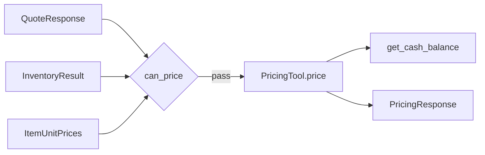
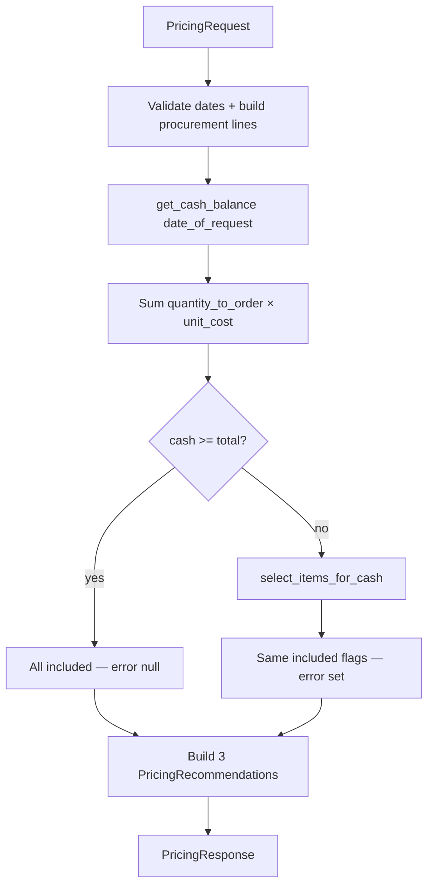
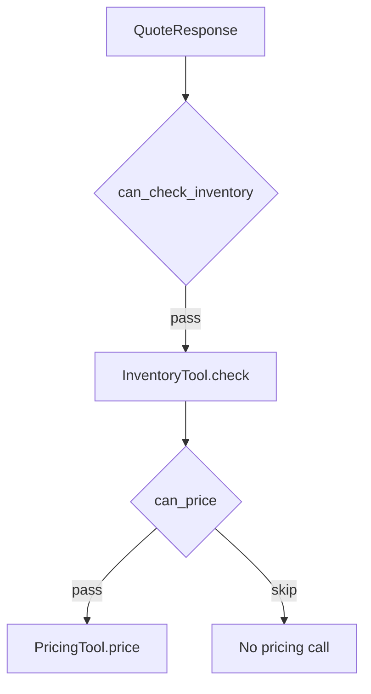

# Pricing Tool — Specification & Test Plan

**Version:** 1.1  
**Date:** 2026-06-07  
**Phase:** 2C — Implemented (deterministic tool; no LLM)  
**System Overview:** [../system_overview.md](../system_overview.md)  
**Upstream input:** [../agents/quoting_agent.md](../agents/quoting_agent.md) (`QuoteResponse`), [inventory_tool.md](inventory_tool.md) (`InventoryResult`), [pricing_review_agent.md](../agents/pricing_review_agent.md) (`ItemUnitPrices`)

---

## Table of Contents

1. [Overview](#1-overview)
2. [Project Layout](#2-project-layout)
3. [Pydantic Models](#3-pydantic-models)
4. [Dependencies](#4-dependencies)
5. [Data Sources](#5-data-sources)
6. [Class Interface](#6-class-interface)
7. [Processing Pipeline](#7-processing-pipeline)
8. [Strategy Pricing](#8-strategy-pricing)
9. [Subset Selection](#9-subset-selection)
10. [Error Handling](#10-error-handling)
11. [Orchestrator Integration](#11-orchestrator-integration)
12. [Test Plan](#12-test-plan)
13. [Running Tests](#13-running-tests)

---

## 1. Overview

This specification defines the **`PricingTool`** class — a **deterministic** component (no AI/LLM calls). It receives a successful [`QuoteResponse`](../agents/quoting_agent.md), a fully fulfillable [`InventoryResult`](inventory_tool.md), and **required** per-item min / avg / max unit prices from the [Pricing Review Agent](../agents/pricing_review_agent.md), then returns **three structured pricing recommendations**:

1. **Maximize Profit** — `max_unit_price` per item
2. **Average Pricing** — `avg_unit_price` per item
3. **Maximize Turnover** — `min_unit_price` per item

The tool does not return prose quotes. It produces machine-readable line items, totals, and profit figures. It does **not** search quote history — price bands are supplied by the orchestrator from `PricingReviewResponse`.

`DEFAULT_STRATEGY_MULTIPLIERS` remain in this module as the **fallback source** when the Pricing Review Agent has insufficient history. `min_unit_price` must never be below `unit_cost × MIN_UNIT_PRICE_FLOOR` (0.85).

When available cash cannot fund procurement for every line, the tool deterministically selects the profit-maximizing affordable subset and applies the same `included` flags to all three strategies.



This document is self-contained: a developer can implement `tools/pricing_tool.py` and `tests/test_pricing_tool.py` using only this spec plus [`project_starter.py`](../../project_starter.py) for `get_cash_balance`.

---

## 2. Project Layout

### 2.1 Files produced

```
/workspace/
├── tools/
│   └── pricing_tool.py         # Models + PricingTool class
├── tests/
│   └── test_pricing_tool.py    # P-H*, P-C*, P-E* scenarios (Section 12)
├── project_starter.py          # get_cash_balance
└── specification/tools/
    └── pricing_tool.md         # This document
```

### 2.2 Imports (top of `tools/pricing_tool.py`)

```python
from itertools import chain, combinations
from typing import Callable, Literal, Optional

from pydantic import BaseModel, Field

from agents.quoting_agent import QuoteResponse
from project_starter import get_cash_balance
from tools.inventory_tool import InventoryResult
```

### 2.3 Environment

`PricingTool` makes no network or LLM calls. It does **not** require `OPENAI_API_KEY` or `.env` loading.

### 2.4 Module-level constants

```python
MAX_SUBSET_LINES = 20

MIN_UNIT_PRICE_FLOOR = 0.85

DEFAULT_STRATEGY_MULTIPLIERS = {
    "maximize_profit": 1.20,
    "average_pricing": 1.05,
    "maximize_turnover": 0.92,
}

STRATEGY_ORDER = ["maximize_profit", "average_pricing", "maximize_turnover"]
```

`DEFAULT_STRATEGY_MULTIPLIERS` and `default_unit_prices()` are exported for the Pricing Review Agent fallback path.

---

## 3. Pydantic Models

### 3.1 Public models

```python
class ItemUnitPrices(BaseModel):
    product_name: str
    min_unit_price: float               # required; maximize_turnover strategy price
    avg_unit_price: float               # required; average_pricing strategy price
    max_unit_price: float               # required; maximize_profit strategy price

class PricedLineItem(BaseModel):
    product_name: str
    quantity_requested: int
    quantity_fulfilled: int         # quantity_requested when included; 0 when excluded
    unit_cost: float                # catalog cost from quote (QuoteItem.unit_price)
    unit_price: float               # min / avg / max from ItemUnitPrices per strategy
    line_revenue: float             # unit_price × quantity_fulfilled
    line_acquisition_cost: float    # unit_cost × quantity_to_order when included
    included: bool                  # False when excluded due to insufficient cash

class PricingRecommendation(BaseModel):
    strategy: Literal["maximize_profit", "average_pricing", "maximize_turnover"]
    items: list[PricedLineItem]
    total_acquisition_cost: float
    total_profit: float
    error: Optional[str] = None     # non-null when any line excluded for cash

class PricingResponse(BaseModel):
    success: bool
    date_of_request: str
    need_date: str
    recommendations: list[PricingRecommendation]  # always exactly 3

class PricingRequest(BaseModel):
    """Orchestrator handoff: quote + inventory + unit price bands."""
    quote: QuoteResponse
    inventory: InventoryResult
    unit_prices: list[ItemUnitPrices]   # required; one per quote line
```

**`PricingResponse` fields:**

| Field | Type | Description |
|---|---|---|
| `success` | bool | `true` when all three recommendations are complete and valid |
| `date_of_request` | string (YYYY-MM-DD) | From quote |
| `need_date` | string (YYYY-MM-DD) | From quote |
| `recommendations` | list | Fixed order: maximize_profit, average_pricing, maximize_turnover |

**`PricingRecommendation` fields:**

| Field | Type | Description |
|---|---|---|
| `strategy` | string | One of the three strategy literals |
| `items` | list[PricedLineItem] | All quote lines; excluded lines have `included=False` |
| `total_acquisition_cost` | float | Sum of `line_acquisition_cost` for included lines |
| `total_profit` | float | Sum of `(line_revenue - line_acquisition_cost)` for included lines |
| `error` | string or null | Non-null when cash cannot fund every line; `null` on full success |

All errors live on `PricingRecommendation.error`. `PricingResponse` has no `error` field. Cash balance is used internally but is **not** exposed on the response.

### 3.2 Internal models

```python
class ProcurementLine(BaseModel):
    product_name: str
    quantity_requested: int
    quantity_to_order: int
    unit_cost: float

class SelectItemsResult(BaseModel):
    included_by_product: dict[str, bool]
    error: Optional[str] = None
```

### 3.3 Upstream field mapping

| Source | Field | Use in pricing |
|---|---|---|
| `QuoteResponse` | `date_of_request` | Cash balance as-of date; echoed on response |
| `QuoteResponse` | `need_date` | Echoed on response |
| `QuoteResponse.items[]` | `product_name` | Join key to inventory |
| `QuoteResponse.items[]` | `quantity_requested` | `quantity_fulfilled` when included |
| `QuoteResponse.items[]` | `unit_price` | **`unit_cost`** (catalog cost) |
| `InventoryResult.items[]` | `product_name` | Join key to quote |
| `InventoryResult.items[]` | `quantity_to_order` | Procurement cost and subset selection |
| `InventoryResult.items[]` | `success` | Must all be `True` (orchestrator gate) |
| `PricingReviewResponse.items[]` | `min/avg/max_unit_price` | **Required** input as `ItemUnitPrices` |
| `PricingReviewResponse.items[]` | `product_name` | Join key to quote lines |

**Validation:** Every quote line must have a matching `ItemUnitPrices` entry. `min_unit_price` must be `>= unit_cost × MIN_UNIT_PRICE_FLOOR` (0.85).

---

## 4. Dependencies

From [`requirements.txt`](../../requirements.txt):

| Package | Use |
|---|---|
| `pydantic>=2.0` | Models |

Standard library: `itertools`.

No model, API key, or `.env` configuration is required. Behavior is controlled by constructor arguments (Section 5.2).

---

## 5. Data Sources

### 5.1 `get_cash_balance(as_of_date) -> float`

Returns net cash balance from the transactions ledger as of `as_of_date` (`YYYY-MM-DD`).

**Call site:** `get_cash_balance(quote.date_of_request)`

The seeded database is random (`init_database(seed=...)`), so **tests MUST mock** this function via the constructor (Section 5.2).

### 5.2 Constructor overrides

```python
def __init__(
    self,
    cash_balance_fn: Callable[[str], float] | None = None,
) -> None: ...
```

- `cash_balance_fn` defaults to `get_cash_balance`
- Tests pass a mock returning a fixed balance

---

## 6. Class Interface

```python
class PricingTool:
    def price(self, request: PricingRequest) -> PricingResponse:
        """Build three strategy recommendations from quote + inventory."""
```

- **Input:** `PricingRequest` (quote + inventory + required `unit_prices`)
- **Output:** `PricingResponse` with exactly three `PricingRecommendation` entries
- **Sync and deterministic** given fixed `cash_balance_fn` and upstream inputs

### Orchestrator gate

```python
def can_price(quote: QuoteResponse, inventory: InventoryResult) -> bool:
    return (
        quote.success
        and quote.date_of_request is not None
        and quote.need_date is not None
        and len(quote.items) > 0
        and len(inventory.items) == len(quote.items)
        and all(item.success for item in inventory.items)
    )
```

`can_price` lives in `tools/pricing_tool.py`. The orchestrator must call it before `PricingTool.price()`. The tool does not read `QuoteResponse.success` for routing — that is an orchestrator concern.

---

## 7. Processing Pipeline



### Step 1 — Validate and join

```python
def build_procurement_lines(
    quote: QuoteResponse,
    inventory: InventoryResult,
) -> list[ProcurementLine]:
    if len(quote.items) != len(inventory.items):
        raise ValueError(
            f"Quote/inventory item count mismatch: "
            f"{len(quote.items)} vs {len(inventory.items)}"
        )
    inv_by_name = {item.product_name: item for item in inventory.items}
    lines = []
    for quote_item in quote.items:
        checked = inv_by_name.get(quote_item.product_name)
        if checked is None:
            raise ValueError(f"No inventory row for {quote_item.product_name!r}")
        lines.append(ProcurementLine(
            product_name=quote_item.product_name,
            quantity_requested=quote_item.quantity_requested,
            quantity_to_order=checked.quantity_to_order,
            unit_cost=quote_item.unit_price,
        ))
    return lines
```

Raise `ValueError` on mismatch; `price()` catches this and returns `success=False` (Section 10).

### Step 2 — Cash balance

```python
cash_balance = self._cash_balance_fn(quote.date_of_request)
```

### Step 3 — Balance check

```python
total_acquisition_cost = sum(
    line.quantity_to_order * line.unit_cost for line in lines
)
```

### Step 4a — Sufficient balance (full fulfillment)

When `cash_balance >= total_acquisition_cost`:

- `included=True` for every line in every strategy
- `quantity_fulfilled = quantity_requested`
- `PricingRecommendation.error = null`

### Step 4b — Insufficient balance (partial fulfillment)

When `cash_balance < total_acquisition_cost`:

- Call `select_items_for_cash(cash_balance, lines)` (Section 9)
- Apply the same `included` flags to all three strategies
- Zero excluded lines; set non-null `error` on each recommendation

### Step 5 — Build recommendations

For each strategy in `STRATEGY_ORDER`, build a `PricingRecommendation`:

```python
# maximize_profit → max_unit_price; average_pricing → avg_unit_price; maximize_turnover → min_unit_price
unit_price = strategy_unit_price(strategy, prices_by_product[product_name])

line_acquisition_cost = unit_cost * quantity_to_order if included else 0.0
line_revenue = unit_price * quantity_fulfilled
line_profit = line_revenue - line_acquisition_cost

total_acquisition_cost = sum(line_acquisition_cost for included lines)
total_profit = sum(line_profit for included lines)
```

Return:

```python
PricingResponse(
    success=True,
    date_of_request=quote.date_of_request,
    need_date=quote.need_date,
    recommendations=recommendations,
)
```

---

## 8. Strategy Pricing

Selling prices come from **required** `ItemUnitPrices` input (supplied by Pricing Review Agent):

| Strategy | `unit_price` source |
|---|---|
| `maximize_profit` | `max_unit_price` |
| `average_pricing` | `avg_unit_price` |
| `maximize_turnover` | `min_unit_price` |

### Fallback multipliers (Pricing Review Agent only)

When history has fewer than 3 orders, the Pricing Review Agent calls `default_unit_prices()`:

| Band | Multiplier on `unit_cost` |
|---|---|
| `min_unit_price` | **0.92** (floored at **0.85**) |
| `avg_unit_price` | **1.05** |
| `max_unit_price` | **1.20** |

```python
def default_unit_prices(product_name: str, unit_cost: float) -> ItemUnitPrices:
    raw_min = round(unit_cost * DEFAULT_STRATEGY_MULTIPLIERS["maximize_turnover"], 2)
    return ItemUnitPrices(
        product_name=product_name,
        min_unit_price=clamp_min_unit_price(unit_cost, raw_min),
        avg_unit_price=round(unit_cost * 1.05, 2),
        max_unit_price=round(unit_cost * 1.20, 2),
    )
```

Subset selection uses `max_unit_price` (same as `maximize_profit` strategy) when ranking affordable lines.

**Example (fallback):** `unit_cost = 0.10`

| Strategy | `unit_price` |
|---|---|
| `maximize_profit` | 0.12 |
| `average_pricing` | 0.11 |
| `maximize_turnover` | 0.09 |

---

## 9. Subset Selection

Called internally when `cash_balance < total_acquisition_cost`.

**Selection profit:**

```python
line_profit = max_unit_price * quantity_requested - unit_cost * quantity_to_order
```

**Algorithm — exhaustive combinatorial search:**

```python
def all_nonempty_subsets(lines):
    return chain.from_iterable(
        combinations(lines, r) for r in range(1, len(lines) + 1)
    )

best_subset = ()
best_profit = float("-inf")
best_revenue = float("-inf")

for subset in all_nonempty_subsets(lines):
    total_cost = sum(item.quantity_to_order * item.unit_cost for item in subset)
    if total_cost > cash_balance:
        continue
    total_profit = sum(line_profit(item) for item in subset)
    total_revenue = sum(
        prices_by_product[line.product_name].max_unit_price * line.quantity_requested
        for line in subset
    )
    if total_profit > best_profit or (
        total_profit == best_profit and len(subset) > len(best_subset)
    ) or (
        total_profit == best_profit
        and len(subset) == len(best_subset)
        and total_revenue > best_revenue
    ):
        best_profit = total_profit
        best_revenue = total_revenue
        best_subset = subset
```

**Tie-break:** more included lines, then higher total selection revenue.

**Safety cap:** if `len(lines) > MAX_SUBSET_LINES` (20), set all `included=False` and return a non-null error — do not enumerate.

**Output:** `included_by_product` dict and non-empty `error` when any line is excluded.

---

## 10. Error Handling

### Upstream mismatch (`ValueError` from `build_procurement_lines`)

Return `success=False` with empty `items[]` on each recommendation and a non-null `error` describing the problem:

```python
def _failure_response(
    date_of_request: str,
    need_date: str,
    message: str,
) -> PricingResponse:
    recommendations = [
        PricingRecommendation(
            strategy=strategy,
            items=[],
            total_acquisition_cost=0.0,
            total_profit=0.0,
            error=message,
        )
        for strategy in STRATEGY_ORDER
    ]
    return PricingResponse(
        success=False,
        date_of_request=date_of_request,
        need_date=need_date,
        recommendations=recommendations,
    )
```

### Missing dates

If `quote.date_of_request` or `quote.need_date` is `None`, return `_failure_response` with an appropriate message. Do not call `get_cash_balance`.

### Cash-constrained partial fulfillment

Not a tool-level failure. `success=True`; per-recommendation `error` is non-null; excluded lines have `included=False`.

---

## 11. Orchestrator Integration

After inventory confirms every line is fulfillable, the orchestrator may call the pricing tool.



**Flow:**

```python
from agents.quoting_agent import call_quoting_agent, QuoteResponse
from tools.inventory_tool import InventoryTool, InventoryResult, quote_to_inventory_request
from agents.pricing_review_agent import call_pricing_review_agent, PricingReviewRequest
from tools.pricing_tool import PricingTool, PricingRequest, ItemUnitPrices, can_price

quote: QuoteResponse = call_quoting_agent(request_with_date)
inventory: InventoryResult = InventoryTool().check(quote_to_inventory_request(quote))
pricing_review = call_pricing_review_agent(PricingReviewRequest(quote=quote))

unit_prices = [
    ItemUnitPrices(
        product_name=item.product_name,
        min_unit_price=item.min_unit_price,
        avg_unit_price=item.avg_unit_price,
        max_unit_price=item.max_unit_price,
    )
    for item in pricing_review.items
]

if can_price(quote, inventory):
    pricing = PricingTool().price(
        PricingRequest(quote=quote, inventory=inventory, unit_prices=unit_prices)
    )
```

The orchestrator returns `PricingResponse` directly to the caller — same pattern as `InventoryResult` from `InventoryTool.check()`.

---

## 12. Test Plan

Scenarios in `tests/test_pricing_tool.py`. All tests run **without an LLM or API key**. Mock `cash_balance_fn` via the `PricingTool` constructor.

### 12.1 Happy path (full cash — 4a)

| ID | Scenario | Key assertions |
|---|---|---|
| P-H1 | Full cash, multi-item order | 3 recommendations; all `error=null`; unit prices from `unit_prices` input |
| P-H2 | Per-strategy price ordering | For each line: profit price > avg price > turnover price |
| P-H3 | Single-item order | One line; three strategies; correct `total_profit` |

### 12.2 Edge cases

| ID | Scenario | Key assertions |
|---|---|---|
| P-E1 | Mismatched quote/inventory item count | `success=False`; each recommendation has non-null `error` |
| P-E2 | Inventory item with `success=False` | Orchestrator gate prevents call |
| P-E3 | `len(lines) > MAX_SUBSET_LINES` with insufficient cash | All lines excluded; non-null `error` |

### 12.3 Insufficient cash (4b)

| ID | Scenario | Key assertions |
|---|---|---|
| P-C1 | Cash covers one of three lines | Best-profit line `included=True`; others `included=False`; non-null `error` |
| P-C2 | Cash covers two of three (pair wins over single) | Pair with highest combined profit selected |
| P-C3 | Same subset applied to all three strategies | Different `unit_price` per strategy; same `included` flags |

**P-C1 example** (`maximize_profit` selection, multiplier 1.20):

| Line | qty_requested | qty_to_order | unit_cost | acq cost | line profit |
|---|---|---|---|---|---|
| A4 paper | 500 | 500 | 0.05 | $25.00 | $5.00 |
| Cardstock | 300 | 200 | 0.15 | $30.00 | $24.00 |
| Banner paper | 1000 | 1000 | 0.30 | $300.00 | $60.00 |

`cash_balance = $50.00` → Cardstock only (`included=True`); A4 and Banner excluded.

**P-C2 example:**

| Line | qty_to_order | unit_cost | acq cost | line profit |
|---|---|---|---|---|
| Colored paper | 200 | 0.10 | $20.00 | $4.00 |
| Glossy paper | 100 | 0.20 | $20.00 | $4.00 |
| Poster paper | 500 | 0.25 | $125.00 | $25.00 |

`cash_balance = $45.00` → Colored + Glossy ($8 combined profit); Poster excluded.

### 12.4 Mandatory coverage

| Function | Min tests |
|---|---|
| `PricingTool.price` | P-H1–P-H3, P-C1–P-C3 |
| `select_items_for_cash` | P-C1, P-C2 (direct unit tests) |
| `can_price` | P-E2 gate behavior |

---

## 13. Running Tests

```bash
source /workspace/.venv/bin/activate
PYTHONPATH=/workspace python tests/test_pricing_tool.py
```
